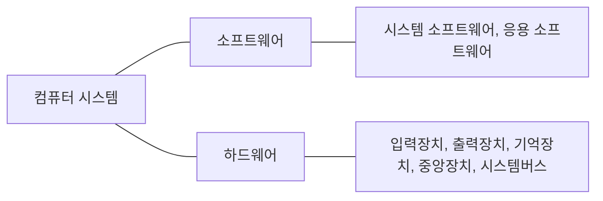

# 컴퓨터시스템구조 - Computer System Structure

* [1️⃣ 컴퓨터시스템 개요](#one-%EC%BB%B4%ED%93%A8%ED%84%B0%EC%8B%9C%EC%8A%A4%ED%85%9C-%EA%B0%9C%EC%9A%94)
  * [1\. 역사 및 세대별 발전과정](#1-%EC%97%AD%EC%82%AC-%EB%B0%8F-%EC%84%B8%EB%8C%80%EB%B3%84-%EB%B0%9C%EC%A0%84%EA%B3%BC%EC%A0%95)
  * [2\. 컴퓨터 기본구조](#2-%EC%BB%B4%ED%93%A8%ED%84%B0-%EA%B8%B0%EB%B3%B8%EA%B5%AC%EC%A1%B0)
  * [3\. 컴퓨터 분류](#3-%EC%BB%B4%ED%93%A8%ED%84%B0-%EB%B6%84%EB%A5%98)
* [2️⃣ 데이터 표현 및 연산](#two-%EB%8D%B0%EC%9D%B4%ED%84%B0-%ED%91%9C%ED%98%84-%EB%B0%8F-%EC%97%B0%EC%82%B0)
  * [1\. 진법과 진법변환](#1-%EC%A7%84%EB%B2%95%EA%B3%BC-%EC%A7%84%EB%B2%95%EB%B3%80%ED%99%98)
  * [2\. 보수](#2-%EB%B3%B4%EC%88%98)
  * [3\. 데이터의 표현](#3-%EB%8D%B0%EC%9D%B4%ED%84%B0%EC%9D%98-%ED%91%9C%ED%98%84)
  * [4\. 연산](#4-%EC%97%B0%EC%82%B0)
* [3️⃣ 디지털 논리회로](#three-%EB%94%94%EC%A7%80%ED%84%B8-%EB%85%BC%EB%A6%AC%ED%9A%8C%EB%A1%9C)
  * [1\. 부울대수 및 논리게이트](#1-%EB%B6%80%EC%9A%B8%EB%8C%80%EC%88%98-%EB%B0%8F-%EB%85%BC%EB%A6%AC%EA%B2%8C%EC%9D%B4%ED%8A%B8)
  * [2\. 조합 논리회로](#2-%EC%A1%B0%ED%95%A9-%EB%85%BC%EB%A6%AC%ED%9A%8C%EB%A1%9C)
  * [3\. 순차 논리회로](#3-%EC%88%9C%EC%B0%A8-%EB%85%BC%EB%A6%AC%ED%9A%8C%EB%A1%9C)
* [:four: CPU의 구조와 기능](#four-cpu%EC%9D%98-%EA%B5%AC%EC%A1%B0%EC%99%80-%EA%B8%B0%EB%8A%A5)
  * [1\. CPU 구성요소](#1-cpu-%EA%B5%AC%EC%84%B1%EC%9A%94%EC%86%8C)
  * [2\. 명령어 사이클](#2-%EB%AA%85%EB%A0%B9%EC%96%B4-%EC%82%AC%EC%9D%B4%ED%81%B4)
  * [3\. 명령어 파이프라이닝](#3-%EB%AA%85%EB%A0%B9%EC%96%B4-%ED%8C%8C%EC%9D%B4%ED%94%84%EB%9D%BC%EC%9D%B4%EB%8B%9D)
* [5️⃣ 컴퓨터 명령어](#five-%EC%BB%B4%ED%93%A8%ED%84%B0-%EB%AA%85%EB%A0%B9%EC%96%B4)
  * [1\. 명령어 세트](#1-%EB%AA%85%EB%A0%B9%EC%96%B4-%EC%84%B8%ED%8A%B8)
  * [2\. 주소 지정 방식](#2-%EC%A3%BC%EC%86%8C-%EC%A7%80%EC%A0%95-%EB%B0%A9%EC%8B%9D)
* [6️⃣ 제어장치](#six-%EC%A0%9C%EC%96%B4%EC%9E%A5%EC%B9%98)
  * [1\. 제어장치의 기능](#1-%EC%A0%9C%EC%96%B4%EC%9E%A5%EC%B9%98%EC%9D%98-%EA%B8%B0%EB%8A%A5)
  * [2\. 제어장치의 구조](#2-%EC%A0%9C%EC%96%B4%EC%9E%A5%EC%B9%98%EC%9D%98-%EA%B5%AC%EC%A1%B0)
  * [3\. 명령어 사이클에서의 제어신호](#3-%EB%AA%85%EB%A0%B9%EC%96%B4-%EC%82%AC%EC%9D%B4%ED%81%B4%EC%97%90%EC%84%9C%EC%9D%98-%EC%A0%9C%EC%96%B4%EC%8B%A0%ED%98%B8)
  * [4\. 마이크로 프로그램 제어방식](#4-%EB%A7%88%EC%9D%B4%ED%81%AC%EB%A1%9C-%ED%94%84%EB%A1%9C%EA%B7%B8%EB%9E%A8-%EC%A0%9C%EC%96%B4%EB%B0%A9%EC%8B%9D)
  * [5\. 하드와이어드(hardwired) 제어](#5-%ED%95%98%EB%93%9C%EC%99%80%EC%9D%B4%EC%96%B4%EB%93%9Chardwired-%EC%A0%9C%EC%96%B4)
* [7️⃣ 기억장치](#seven-%EA%B8%B0%EC%96%B5%EC%9E%A5%EC%B9%98)
  * [1\. 기어장치 개요](#1-%EA%B8%B0%EC%96%B4%EC%9E%A5%EC%B9%98-%EA%B0%9C%EC%9A%94)
  * [2\. 주 기억장치](#2-%EC%A3%BC-%EA%B8%B0%EC%96%B5%EC%9E%A5%EC%B9%98)
  * [3\. 캐시 기억장치](#3-%EC%BA%90%EC%8B%9C-%EA%B8%B0%EC%96%B5%EC%9E%A5%EC%B9%98)
* [8️⃣ 보조기억장치](#eight-%EB%B3%B4%EC%A1%B0%EA%B8%B0%EC%96%B5%EC%9E%A5%EC%B9%98)
  * [1\. 자기디스크](#1-%EC%9E%90%EA%B8%B0%EB%94%94%EC%8A%A4%ED%81%AC)
  * [2\. 광기억장치](#2-%EA%B4%91%EA%B8%B0%EC%96%B5%EC%9E%A5%EC%B9%98)
  * [3\. 레이드(RAID)](#3-%EB%A0%88%EC%9D%B4%EB%93%9Craid)
* [9️⃣ 시스템 버스 및 입출력장치](#nine-%EC%8B%9C%EC%8A%A4%ED%85%9C-%EB%B2%84%EC%8A%A4-%EB%B0%8F-%EC%9E%85%EC%B6%9C%EB%A0%A5%EC%9E%A5%EC%B9%98)
  * [1\. 시스템버스](#1-%EC%8B%9C%EC%8A%A4%ED%85%9C%EB%B2%84%EC%8A%A4)
  * [2\. 버스중재(arbitration)](#2-%EB%B2%84%EC%8A%A4%EC%A4%91%EC%9E%ACarbitration)
  * [3\. 입출력장치 제어](#3-%EC%9E%85%EC%B6%9C%EB%A0%A5%EC%9E%A5%EC%B9%98-%EC%A0%9C%EC%96%B4)
  * [4\. 입출력 주소 지정](#4-%EC%9E%85%EC%B6%9C%EB%A0%A5-%EC%A3%BC%EC%86%8C-%EC%A7%80%EC%A0%95)
  * [5\. 인터럽트를 이용한 입출력](#5-%EC%9D%B8%ED%84%B0%EB%9F%BD%ED%8A%B8%EB%A5%BC-%EC%9D%B4%EC%9A%A9%ED%95%9C-%EC%9E%85%EC%B6%9C%EB%A0%A5)
  * [6\. DMA를 이용한 입출력](#6-dma%EB%A5%BC-%EC%9D%B4%EC%9A%A9%ED%95%9C-%EC%9E%85%EC%B6%9C%EB%A0%A5)
* [🔟 컴퓨터구조의 경향](#keycap_ten-%EC%BB%B4%ED%93%A8%ED%84%B0%EA%B5%AC%EC%A1%B0%EC%9D%98-%EA%B2%BD%ED%96%A5)
  * [1\. 컴퓨터 성능평가](#1-%EC%BB%B4%ED%93%A8%ED%84%B0-%EC%84%B1%EB%8A%A5%ED%8F%89%EA%B0%80)
  * [2\. RISC vs\. CISC](#2-risc-vs-cisc)
  * [3\. 병렬컴퓨터](#3-%EB%B3%91%EB%A0%AC%EC%BB%B4%ED%93%A8%ED%84%B0)

## :one: 컴퓨터시스템 개요

### 1. 역사 및 세대별 발전과정

시스템: 그 시스템에 부여된 목적을 달성하기 위해 상호작용하는 구성요소들의 집합

- 컴퓨터의 세대별 특징

| 세대       | 제1세대              | 제2세대                     | 제3세대  | 제4세대                                   | 차세대                                           |
| ---------- | -------------------- | --------------------------- | -------- | ----------------------------------------- | ------------------------------------------------ |
| 년도       | 1940                 | 1950                        | 1960     | 1970 ~                                    | 1980 ~                                           |
| 특징       | 진공관               | 트랜지스터                  | 집적회로 | LSI / 마이크로프로세서                    | VLSI                                             |
| 대표시스템 | ENIAC, EDVAC, UNIVAC | TX-O, IBM 704-709, IBM 7094 | IBM 360  | IBX PC-XT, 애플사의 매킨토시, 미니 컴퓨터 | 대규모 병렬처리 컴퓨터, 광 컴퓨터, 신경망 컴퓨터 |

#### - 제1세대 컴퓨터

- 진공관을 이용한 전자식 컴퓨터
- 컴퓨터 제어가 단일 중앙처리장치에 집중
- 어셈블리어(assembly language) 사용

- ENIAC(Electronic Numerical Integrator And Calculator)
  - 최초의 범용 전자식 컴퓨터
- EDVAC(Electronic Discrete Variable Automatic Computer)
  - [프로그램 내장형 컴퓨터](#### - 폰노이만 모델)
  - 10진수가 아닌 2진수 표현 사용
- UNIVAC(UNIVersal Automatic Computer)
  - 최초의 일반 업무용 컴퓨터

#### - 제2세대 컴퓨터

- 트랜지스터 사용
- 고급 프로그래밍 언어 사용(COBOL, FORTRAN, 등)
- 큰 용량의 기억장치
- 입출력 처리장치 같은 처리장치 도입으로 중앙처리장치의 시간낭비 줄임
- 컴파일러, 소프트웨어 라이브러리 등 제공
- 하드웨어 설계 시 모듈화 개념 도입
- 자기디스크의 개발로 보조기억장치에 대한 직접 접근 가능

- TX-O

  - 초기 트랜지스터 컴퓨터

- IBM 704/709

  - 704 - 인덱스 리지스터 & 부동 소수점 하드웨어 가짐

  - 709 - 입출력 처리장치, 데이터 동기화 처리장치, 채널 가짐

- IBM 7094

  - 709 버전에서 진공관 -> 트랜지스터
  - 중앙처리장치에 산술회로 추가
  - 입출력은 주기억장치로 직접 접근하는 입출력 처리장치에 의해 제어

#### - 제3세대 컴퓨터

- 집적회로(IC: Integrated Circuit) 등장
- IBM 360
  - 직접회로 사용
  - 최초로 컴퓨터 계열 개념 도입
  - 컴퓨터 구조와 구현 분리

#### - 제4세대 컴퓨터

- 대규모 집적회로(LSI: Large Scale IC) 사용
- 이후 반도체 기술의 발달로 초대규모 집적회로(VLSI:Ver LSI) 개발, 현재까지 사용
- 마이크로프로세서 개발(컴퓨터의 주요 구성요소들을 하나의 반도체 칩으로 모두 집적)
- 개인용 컴퓨터 보급
- 업무 효율성을 위해 자동화

#### - 차세대 컴퓨터

- 대규모 병렬처리 컴퓨터(MPP: Massively Parallel Processing computer)
  - 병렬처리기법(중복된 하드웨어를 효율적으로 활용하는 방법) 도입, 대규모의 병렬처리 가능
  - 상호연결망(interconnection network) 연결, 상호 협동적인 직업 수행
- 광 컴퓨터(optical computer)
  - 빛의 속도가 전자의 속도보다 빠르다는 관점에서 착안
- 신경망 컴퓨터(neural-net computer)
  - 폰 노이만의 프로그램 내장형 컴퓨터 구조의 문제접 해결방법
  - 감각정보처리를 모방한 컴퓨터 구조

### 2. 컴퓨터 기본구조

#### - 구성요소

- 입력장치

- 출력장치

- 기억장치

  - 주기억장치
    - 중앙처리장치가 처리할 데이터와 명령어들을 저장, 대부분 DRAM 구성
  - 캐시
    - 주기억장치와 중앙처리장치 사이에 위치
    - 데이터를 중앙처리에 빨리 전달, 대부분 SRAM 구성

  - 보조기억장치

    - 대량의 데이터 저장

    - 전원이 꺼져도 후에 사용할수 있음

- 중앙처리장치

  실제 연산 수행, 제어작용

- 시스템버스

  장치 사이 통신 가능하게 해 주는 통신 선로

#### - 폰노이만 모델

EDVAC의 문제점 해결을 위해 폰 노이만, 프로그램 내장 방식(stored program concpet) 제안

- 프로그램 내장 방식: 프로그램과 데이터를 모두 기억장소 저장 및 실행

#### - 시스템버스 모델

### 3. 컴퓨터 분류

#### - 처리성능과 규모에 따른 분류 - PC, 미니, 메인프레임, 슈퍼컴퓨터 등

#### - 구조에 따른 분류 - 병렬컴퓨터, 분산컴퓨팅, 클라우드컴퓨팅 등

---

## :two: 데이터 표현 및 연산

### 1. 진법과 진법변환

#### - 진법

#### - 진법 변환

### 2. 보수

#### - 보수체계

#### - 보수를 이용한 연산

### 3. 데이터의 표현

#### - 정수표현

#### - 부동소수점표현

#### - 문자표현 및 코드체계

### 4. 연산

#### - 산술연산

#### - 논린연산

#### - 비트연산

---

## :three: 디지털 논리회로

### 1. 부울대수 및 논리게이트

#### - 부울대수

#### - 부울함수의 간략화

#### - 논리게이트 - AND, OR, NOT, XOR, NAND, NOR 등

#### - 논리 회로(logic diagram)

### 2. 조합 논리회로

#### - 가산기

#### - 멀티플렉서, 디멀티플렉서

#### - 인코더, 디코더

### 3. 순차 논리회로

#### - 플립플롭

#### - 레지스터

#### - 카운터

#### - 메모리셀

---

## :four: CPU의 구조와 기능

### 1. CPU 구성요소

#### - 산술논리장치

#### - 레지스터

#### - 제어장치

#### - 내부버스

### 2. 명령어 사이클

#### - 마이크로 연산

#### - 명령어 인출 사이클

#### - 명령어 실행 사이클

### 3. 명령어 파이프라이닝

---

## :five: 컴퓨터 명령어

### 1. 명령어 세트

#### - 명령어 형식

#### - 0-주소 명령어

#### - 1-주소 명령어

#### - 2-주소 명령어

#### - 3-주소 명령어

### 2. 주소 지정 방식

#### - 직접 주소지정방식

#### - 간접 주소지정방식

#### - 즉치 주소지정방식

#### - 묵시적 주소지정방식

#### - 레지스터 주소지정방식

#### - 레지스터 간접주소지정방식

#### - 변위 주소지정방식

---

## :six: 제어장치

### 1. 제어장치의 기능

### 2. 제어장치의 구조

### 3. 명령어 사이클에서의 제어신호

### 4. 마이크로 프로그램 제어방식

#### - 마이크로 명령어의 형식

#### - 마이크로 프로그래밍

#### - 마이크로 프로그램 실행

### 5. 하드와이어드(hardwired) 제어

---

## :seven: 기억장치

### 1. 기어장치 개요

#### - 기억장치 종류 및 특성

#### - 기억장치의 계층적 구조

### 2. 주 기억장치

#### - 주 기억장치의 기능

#### - RAM의 구조 및 종류

#### - ROM의 구조 및 종류

#### - 기억장치 모듈 설계

### 3. 캐시 기억장치

#### - 동작원리

#### - 사상(mapping) 방법

#### - 쓰기정책 - write-through, write-back

#### - 성능 개선효과

---

## :eight: 보조기억장치

### 1. 자기디스크

#### - 디스크 구조 및 용어

#### - 디스크 접근 시간

### 2. 광기억장치

#### - 광기억장치 특성

#### - 광기억장치 종류

### 3. 레이드(RAID)

#### - 레이드(RAID) 개요

#### - 레이드(RAID) 종류 - level 0 ~ level 6

---

## :nine: 시스템 버스 및 입출력장치

### 1. 시스템버스

#### - 시스템버스 구조

#### - 데이터버스

#### - 주소버스

#### - 제어버스

#### - 버스 대역폭

#### - 시스템버스 기본동작

### 2. 버스중재(arbitration)

#### - 병렬 중재방식

#### - 직렬 중재방식

#### - 폴링 방식

### 3. 입출력장치 제어

#### - 입출력장치 제어기

#### - 입출력장치 제어기 동작순서

### 4. 입출력 주소 지정

#### - 기억장치사상 입출력(memory mapped I/O)

#### - 분리형 입출력(isolated I/O)

### 5. 인터럽트를 이용한 입출력

#### - 인터럽트 구동 입출력(interrupt-driven I/O)

#### - 다중 인터럽트 선을 사용하는 방식

#### - 데이지 체인 방식

#### - 소프트웨어 폴링 방식

### 6. DMA를 이용한 입출력

#### - DMA 제어기

#### - DMA 동작순서

#### - 사이클 스틸링(cycle stealing)

---

## :keycap_ten: 컴퓨터구조의 경향

### 1. 컴퓨터 성능평가

### 2. RISC vs. CISC

#### - RISC, CISC 컴퓨터 개념

#### - RISC, CISC 컴퓨터 특징 및 비교

### 3. 병렬컴퓨터

#### - 병렬컴퓨터 개념

#### - 병렬컴퓨터 특징

#### - 병렬컴퓨터 분류 - SISD, SIMD, MISD, MIMD 등

#### - 상호연결망

[↩️ Go Back](https://github.com/lisy0123/CS_Bachelors_Degree_Examination_for_Self-Education)
