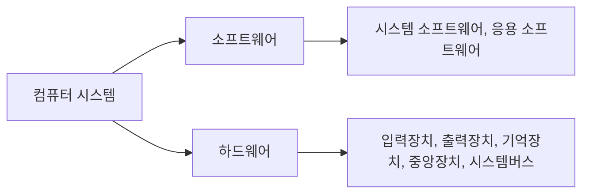
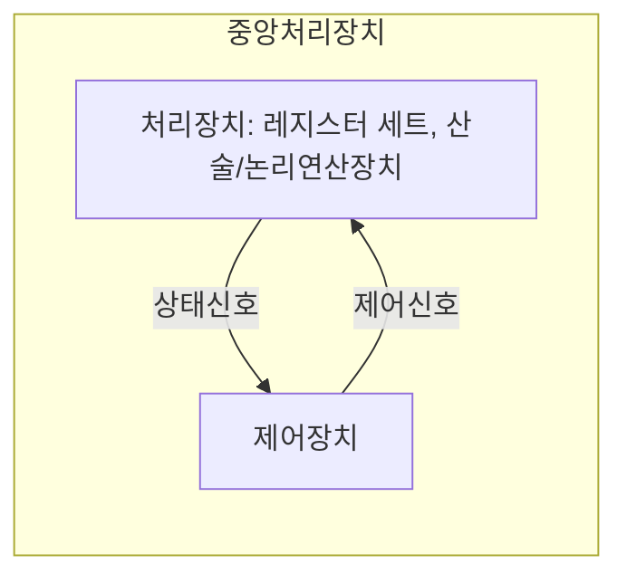
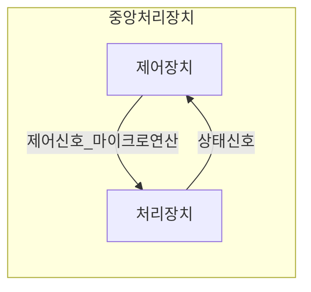

# 컴퓨터시스템구조 - Computer System Structure

[TOC]

## :one: 컴퓨터시스템 개요

### 1. 역사 및 세대별 발전과정

- **시스템**: 그 시스템에 부여된 목적을 달성하기 위해 상호작용하는 구성요소들의 집합

#### - 컴퓨터의 세대별 특징

|    세대     | 제1세대              | 제2세대                     | 제3세대  | 제4세대                                   | 차세대                                           |
| :---------: | -------------------- | --------------------------- | :------- | ----------------------------------------- | ------------------------------------------------ |
|    년도     | 1940                 | 1950                        | 1960     | 1970 ~                                    | 1980 ~                                           |
|    특징     | 진공관               | 트랜지스터                  | 집적회로 | LSI / 마이크로프로세서                    | VLSI                                             |
| 대표 시스템 | ENIAC, EDVAC, UNIVAC | TX-O, IBM 704-709, IBM 7094 | IBM 360  | IBX PC-XT, 애플사의 매킨토시, 미니 컴퓨터 | 대규모 병렬처리 컴퓨터, 광 컴퓨터, 신경망 컴퓨터 |

#### - 제1세대 컴퓨터

**진공관**을 이용한 전자식 컴퓨터

컴퓨터 제어가 **단일 중앙처리장치에 집중**

**어셈블리어(assembly language) 사용**

- **ENIAC(Electronic Numerical Integrator And Calculator)**

  최초의 범용 전자식 컴퓨터

- **EDVAC(Electronic Discrete Variable Automatic Computer)**

  EDVAC의 문제점 해결을 위해 폰 노이만, **프로그램 내장 방식**(stored program concpet) 제안

  10진수가 아닌 **2진수 표현 사용**

  - **프로그램 내장형 컴퓨터**: 프로그램과 데이터를 모두 기억장소 저장 및 실행

- **UNIVAC(UNIVersal Automatic Computer)**

  **최초의 일반 업무용 컴퓨터**

#### - 제2세대 컴퓨터

**트랜지스터 사용**

**고급 프로그래밍 언어 사용**(COBOL, FORTRAN, 등)

큰 용량의 기억장치

입출력 처리장치 같은 처리장치 도입으로 중앙처리장치의 **시간낭비 줄임**

컴파일러, 소프트웨어 라이브러리 등 제공

하드웨어 설계 시 **모듈화 개념 도입**

자기디스크의 개발로 보조기억장치에 대한 **직접 접근 가능**

- **TX-O**

  초기 트랜지스터 컴퓨터
  
- **IBM 704/709**

  704 - 인덱스 리지스터 & 부동 소수점 하드웨어 가짐

  709 - 입출력 처리장치, 데이터 동기화 처리장치, 채널 가짐
  
- **IBM 7094**

  709 버전에서 진공관 -> 트랜지스터

  중앙처리장치에 **산술회로 추가**

  입출력은 주기억장치로 직접 접근하는 입출력 처리장치에 의해 제어

#### - 제3세대 컴퓨터

**집적회로(IC: Integrated Circuit) 등장**

- **IBM 360**

  **직접회로 사용**

  최초로 컴퓨터 계열 개념 도입

  컴퓨터 구조와 구현 분리

#### - 제4세대 컴퓨터

**대규모 집적회로(LSI: Large Scale IC) 사용**

이후 반도체 기술의 발달로 **초대규모 집적회로(VLSI:Ver LSI) 개발**, 현재까지 사용

마이크로프로세서 개발(컴퓨터의 주요 구성요소들을 하나의 반도체 칩으로 모두 집적)

개인용 컴퓨터 보급, 업무 효율성을 위해 자동화

#### - 차세대 컴퓨터

- **대규모 병렬처리 컴퓨터(MPP: Massively Parallel Processing computer)**

  **병렬처리기법**(중복된 하드웨어를 효율적으로 활용하는 방법) 도입, 대규모의 병렬처리 가능

  **상호연결망**(interconnection network) 연결, 상호 협동적인 직업 수행
- **광 컴퓨터(optical computer)**

  빛의 속도가 전자의 속도보다 빠르다는 관점에서 착안
- **신경망 컴퓨터(neural-net computer)**

  폰 노이만의 프로그램 내장형 컴퓨터 구조의 문제점 해결방법

  감각정보처리를 모방한 컴퓨터 구조

### 2. 컴퓨터 기본구조

#### - 구성요소

- **입력장치, 출력장치**

- **기억장치**

  - **주기억장치**

    중앙처리장치가 처리할 데이터와 명령어들을 저장, 대부분 DRAM 구성
  - **캐시**

    주기억장치와 중앙처리장치 사이에 위치

    데이터를 중앙처리에 빨리 전달, 대부분 SRAM 구성

  - **보조기억장치**

    대량의 데이터 저장

    전원이 꺼져도 후에 사용할수 있음

- **중앙처리장치**

  실제 연산 수행, 제어작용

- **시스템버스**

  장치 사이 통신 가능하게 해 주는 통신 선로

  주소버스, 데이터버스, 제어버스

### 3. 컴퓨터 분류

#### - 처리성능과 규모에 따른 분류

1. **마이크로컴퓨터**

   단일 칩 마이크로 컴퓨터

   PC(Personal Computer)

   워크스테이션

2. **미니컴퓨터**

   서버 등장으로 도태

3. **메인프레임 컴퓨터**

   범용성 강조

4. **슈퍼컴퓨터**

   병렬처리 가능

#### - 구조에 따른 분류

1. **파이프라인 슈퍼컴퓨터**

   고속의 백터 계산

2. **대규모 병렬처리 컴퓨터**

   중앙처리장치의 계산속도의 한계 뛰어넘을 수 있을 컴퓨터으로 주목

3. **분산컴퓨팅**

   인터넷에 연결된 여러 컴퓨터들의 처리 능력을 이용하여 거대한 계산 문제를 해결하려는 분산처리 모델

4. **클라우드컴퓨팅**

   집적·공유된 정보통신기기, 정보통신설비, 소프트웨어 등 정보통신자원을 이용자의 요구나 수요 변화에 따라 

   정보통신망을 통하여 신축적으로 이용할 수 있도록 하는 정보처리체계

---

## :two: 데이터 표현 및 연산

### 1. 진법과 진법변환

#### - 진법

#### - 진법 변환

### 2. 보수

#### - 보수체계

#### - 보수를 이용한 연산

### 3. 데이터의 표현

#### - 정수표현

#### - 부동소수점표현

#### - 문자표현 및 코드체계

### 4. 연산

#### - 산술연산

#### - 논린연산

#### - 비트연산

---

## :three: 디지털 논리회로

### 1. 부울대수 및 논리게이트

#### - 부울대수

#### - 부울함수의 간략화

#### - 논리게이트 - AND, OR, NOT, XOR, NAND, NOR 등

#### - 논리 회로(logic diagram)

### 2. 조합 논리회로

#### - 가산기

#### - 멀티플렉서, 디멀티플렉서

#### - 인코더, 디코더

### 3. 순차 논리회로

#### - 플립플롭

#### - 레지스터

#### - 카운터

#### - 메모리셀

---

## :four: 중앙처리장치(CPU: Central Processing Unit)의 구조와 기능

### 1. CPU 구성요소

컴퓨터에서 명령어 수행, 데이터 처리

프로그램이 수행되는 전반적인 과정 제어

크게 처리장치 & 제어장치로 나뉨

#### - 처리장치

데이터를 처리하는 연산 실행

##### - 처리장치 구성

연산장치와 레지스터들로 구성

- **연산장치(ALU: Arithmetic and Logic Unit)**

  산술/논리연산장치

  산술연산, 논리연산, 비트 연산 등의 연산 수행

  독립적 데이터 처리 수행 불가 -> 데이터 처리 위해 반드시 레지스터 조합 필요

- **레지스터**

  연산에 사용되는 데이터 저장

  연산 결과 저장

##### - 처리장치 구성요소

- 구성요소
  1. 여러개의 레지스터(레지스터 세트)
  2. 산술/논리연산장치(ALU)
  3. 내부버스(internal bus)

##### - 산술/논리장치 (산술/논리연산장치) (ALU)

산술연산회로 & 논리연산회 결합으로 구성

- **산술연산회로**

  가장 기본적인 요소 병렬가산기

  여러 개의 전자가산기 회로를 연속적으로 연결시켜 만듦

  병렬가산기로 들어가는 제어입력값을 선택해 여러 형태의 산술연산 실행

  - 산술연산 종류	/	$F=A+Y+C_{in}$

  | $S_1$ | $S_0$ |      $Y$       | $C_{in}=0$         | $C_{in}=1$                  |
  | :---: | :---: | :------------: | ------------------ | --------------------------- |
  |   0   |   0   |     모두 0     | $F=A$ (전송)       | $F=A+1$ (증가)              |
  |   0   |   1   |      $B$       | $F=A+B$ (가산)     | $F=A+B+1$                   |
  |   1   |   0   | $\overline{B}$ | $F=A+\overline{B}$ | $F=A+\overline{B}+1$ (감산) |
  |   1   |   1   |     모두 1     | $F=A-1$ (감소)     | $F=A$ (전송)                |

- **논리연산회로**

  레지스터의 각 트를 각 독립된 2진 변수로 간주, 비트별 연산 실행

  | $S_1$ | $S_0$ | 출력              | 연산  |
  | :---: | :---: | ----------------- | ----- |
  |   0   |   0   | $F= R1 \land R2$  | $AND$ |
  |   0   |   1   | $F=A \lor B$      | $OR$  |
  |   1   |   0   | $F=A \oplus B$    | $XOR$ |
  |   1   |   1   | $F= \overline{A}$ | $NOT$ |

- **산술/논리연산장치(ALU)**

  | $S_2$ | $S_1$ | $S_0$ | $C_{in}$ | 연산                 | 기능                        |
  | :---: | :---: | :---: | :------: | -------------------- | --------------------------- |
  |   0   |   0   |   0   |    0     | $F=A$                | $A$의 전송                  |
  |   0   |   0   |   0   |    1     | $F=A+1$              | $A$에 1 더하기              |
  |   0   |   0   |   1   |    0     | $F=A+B$              | $+$                         |
  |   0   |   0   |   1   |    1     | $F=A+B+1$            | 캐리값 1과 더하기           |
  |   0   |   1   |   0   |    0     | $F=A+\overline{B}$   | $A$에 $B$의 1의 보수 더하기 |
  |   0   |   1   |   0   |    1     | $F=A+\overline{B}+1$ | $-$                         |
  |   0   |   1   |   1   |    0     | $F=A-1$              | $A$에서 1 뺴기              |
  |   0   |   1   |   1   |    1     | $F=A$                | $A$의 전송                  |
  |   1   |   0   |   0   |    X     | $F=A \land B$        | $AND$                       |
  |   1   |   0   |   1   |    X     | $F=A \lor B$         | $OR$                        |
  |   1   |   1   |   0   |    X     | $F= A \oplus B$      | $XOR$                       |
  |   1   |   1   |   1   |    X     | $F=\overline{A}$     | $A$의 보수                  |

- **상태 레지스터**

  ALU(산술/논리연산장치)에서 산술연산 수행 후, 연산결과에 의해 나타는 상태값 저장

  $C(carry$ $bit)$	\	$S(sign$ $bit)$	\	$Z(zeor$ $bit)$	\	$V(overflow$ $bit)$

- **시프터**

  | $H_1$ | $H_0$ | 연산                   | 기능                     |
  | ----- | ----- | ---------------------- | ------------------------ |
  | 0     | 0     | $S \leftarrow F$       | 시프트 없이 전송         |
  | 0     | 1     | $S \leftarrow shr$ $F$ | 오른쪽 시프트하여 전송   |
  | 1     | 0     | $S \leftarrow shl$ $F$ | 왼쪽 시프트하여 전송     |
  | 1     | 1     | $FS \leftarrow 0$      | 모두 출력비트에 0을 전송 |

##### - 제어단어

처리장치에 있는 선택신호: 처리장치 내에서 수행되는 마이크로연산을 선택하는 변수

처리장치의 버스, ALU, 시프터, 도착 레지스터 등을 제어

선택신호, 즉 제어변수가 처리장치 내에서 특정한 마이크로연산 선택

이런 제어변수들의 묶음 => **제어단어(control word)**

- **제어단어를 구성하는 각 필드 (총 16비트)**
  - $A$ 필드: $ALU$로 입력되는 $A$버스 선택(3비트)	/	1, 2, 3
  - $B$ 필드: $ALU$로 입력되는 $B$버스 선택(3비트)	/	4, 5, 6
  - $F$ 필드: $ALU$의 연산 선택(4비트)	/	7, 8, 9, 10
  - $H$ 필드: 시프터의 연산 선택(3비트)	/	11, 12, 13
  - $D$ 필드: 도착 레지스터 선택(3비트)	/	14, 15, 16

| 2진 코드 |   $A$    |   $B$    | $C$  | $F$: $C_{in}=0$    | $F$: $C_{in}=1$ | $H$         |
| :------: | :------: | :------: | :--: | ------------------ | --------------- | ----------- |
|   000    | 외부입력 | 외부입력 | 없음 | $F=A$              | $F=A+1$         | 시프트 없음 |
|   001    |   $R1$   |   $R1$   | $R1$ | $F=A+B$            | $F=A+B+1$       | $SHR$       |
|   010    |   $R2$   |   $R2$   | $R2$ | $F=A+\overline{B}$ | $F=A-B$         | $SHL$       |
|   011    |   $R3$   |   $R3$   | $R3$ | $F=A-1$            | $F=A$           | $bus=0$     |
|   100    |   $R4$   |   $R4$   | $R4$ | $F=A\land B$       | -               | -           |
|   101    |   $R5$   |   $R5$   | $R5$ | $F=A\lor B$        | -               | $ROR$       |
|   110    |   $R6$   |   $R6$   | $R6$ | $F=A\oplus B$      | -               | $ROL$       |
|   111    |   $R7$   |   $R7$   | $R7$ | $F=\overline{A}$   | -               | -           |

ex) $R1 \leftarrow R2-R3$

| 필드         | $A$  | $B$  | $D$  | $F$     | $H$         |
| ------------ | ---- | ---- | ---- | ------- | ----------- |
| **기호**     | $R2$ | $R3$ | $R1$ | $F=A-B$ | 시프트 없음 |
| **2진 코드** | 010  | 011  | 001  | 0101    | 0000        |

#### - 제어장치

연산의 실행순서 결정하는 역할 ==**(:six: 제어장치 참고)**==

#### - 레지스터

#### - 내부버스

**멀티플렉서 & 디코더 이용**

레지스터들 간의 데이터 전송을 위한 공용선로 집합

- 멀티플렉서: 출발 레지스터 선택
- 디코더: 도착 레지스터 선택

### 2. 명령어 사이클

#### - 마이크로 연산

레지스터나 기억장치에 있는 데이터에 대해 이루어지는 기본적인 연산

##### - 레지스터 전송 마이크로연산

한 레지스터에서 다른 레지스터로 2진 데이터 전송하는 연산

ex) $R2 \leftarrow R1$

- $R1$: 출발 레지스터(source register)
- $R2$: 도착 레지스터(destination register)

조건문 표현: $If(T_1=1)$ $then$ $(R2 \leftarrow R1)$	/	$T_1$: 제어장치에서 발생시키는 제어신호

=> 간단하게 $T_1$ : $R2 \leftarrow R1$	/	$T_1=1$일 때만 해당 하드웨어에서 데이터 전송 실행

- 레지스터 전송문에서 사용하는 기본 기호

| 기호              | 의미                                         | 예                                     |
| ----------------- | -------------------------------------------- | -------------------------------------- |
| 영문자(숫자 포함) | 레지스터 표시                                | $AR$, $R2$, $DR$, $IR$                 |
| 괄호              | 레지스터 일부분                              | $R2(1)$, $R2(7:0)$, $AR(L)$            |
| 화살표            | 자료 이동 표시                               | $R1 \leftarrow R2$                     |
| 쉼표              | 동시에 실행되는 2개 이상의 마이크로연산 구분 | $R1 \leftarrow R2$, $R2 \leftarrow R1$ |
| 대괄호            | 메모리에서의 어드레스                        | $DR \leftarrow M[AR]$                  |

##### - 산술 마이크로연산

레지스터 내에의 데이터에 대해 실행되는 산술연산 ($+$, $-$, $+1$, $-1$, 보수연산)

| 기호표시                           | 의미                                         |
| ---------------------------------- | -------------------------------------------- |
| $R0 \leftarrow R1+R2$              | $R1$과 $R2$의 합을 $R0$에 저장               |
| $R2 \leftarrow \overline{R2}$      | $R2$의 보수(1의 보수)를 $R2$에 저장          |
| $R2 \leftarrow \overline{R2}+1$    | $R2$에 2의 보수를 계산 후 저장               |
| $R0 \leftarrow R1+\overline{R2}+1$ | $R1$에 $R2$의 2의 보수를 더한 후 $R0$에 저장 |
| $R1 \leftarrow R1+1$               | $R1$에 1 더함(상승 카운트)                   |
| $R1 \leftarrow R1-1$               | $R1$에 1 뻄(하강 카운트)                     |

##### - 논리 마이크로연산

레지스터 내의 데이터에 대한 비트를 조작하는 연산 ($AND$, $OR$, $XOR$, $NOT$ 연산)

| 기호표시                      | 의미                             |
| ----------------------------- | -------------------------------- |
| $R0 \leftarrow \overline{R1}$ | 비트별 논리적 $NOT$(1의 보수)    |
| $R0 \leftarrow R1 \land R2$   | 비트별 논리적 $AND$(비트 클리어) |
| $R0 \leftarrow R1 \lor R2$    | 비트별 논리적 $OR$(비트 세트)    |
| $R0 \leftarrow R1 \oplus R2$  | 비트별 논리적 $XOR$(비트별 보수) |

##### - 시프트 마이크로연산

레지스터 내의 데이터를 시프트시키는 연산

데이터 측면이동에 사용

시프트 연산을 수행해도 $R2$의 값은 변하지 않음

$shr$이나 $shl$에 대해 입력비트 0으로 가정	/	출력비트 값 버려짐

| 유형          | 기호표시                 | 출발지 $R2$ | 시프트 후: 목적지 $R1$ |
| ------------- | ------------------------ | ----------- | ---------------------- |
| 왼쪽 시프트   | $R1 \leftarrow shl$ $R2$ | 10011110    | 00111100               |
| 오른쪽 시프트 | $R1 \leftarrow shr$ $R2$ | 11100101    | 01110010               |

#### - 명령어 인출 사이클

#### - 명령어 실행 사이클

### 3. 명령어 파이프라이닝

---

## :five: 컴퓨터 명령어

### 1. 명령어 세트

- **명령어 집합**(instruction set): 컴퓨터에서 사용할 수 있는 명령어의 집합

  모든 컴퓨터는 자신의 명령어 집합 가지고 있음

  컴퓨터의 구조적인 특성 나타내는 가장 중요한 정보

- 명령어 구성

  명령어: 필드(field)라는 비트 그룹

  **연산코드(OP code) & 오퍼랜드(operand) 필드**로 나눠짐

#### - 명령어 형식

##### - 기억장소에 따른 분류

- **누산기**(AC)를 이용한 명령어 형식 

  함수연산기능의 명령어를 수행할 때 오퍼랜드들 중 하나가 누산기에 기억되도록 하는 컴퓨터 구조에서 사용됨

  ex) $ADD$ $X$	;	$AC \leftarrow AC + M[X]$

- **다중 레지스터**를 이용한 명령어 형식

  중앙처리장치 내에 여러 개의 레지스터를 가지고 있는 컴퓨터

  ex) $ADD$ $R1$, $R2$, $R3$	;	$R3 \leftarrow R2 + R2$

- **스택 구조**를 이용한 명령어 형식

  연산에 필요한 오퍼랜드들, 연산 결과를 기억장치 스택에 기억

  - **스택**: 후입선출(LIFO: Last In First Out)

  ex) $ADD$	;	$TOS \leftarrow TOS + TOS_{-1}$

##### - 오퍼랜드의 수에 따른 분류

-  **0-주소 명령어**

   기억장치 스택 사용

   주소 필드 사용 X

   명령어 길이 가장 짧음, 기억공간 적게 차지

   비효율적

   ex) $PUSH$ $A$	;	$TOS \leftarrow M[A]$

   ​	$PUSH$ $B$	  ;	$TOS \leftarrow M[B]$

   ​	$ADD$			 ;	$TOS \leftarrow TOS + TOS_{-1}$

   ​	$PUSH$ $C$ 	 ;	$TOS \leftarrow M[C]$

   ​	$MUL$ 			;	$TOS \leftarrow TOS \times TOS_{-1}$

   ​	$POP$ $X$		 ;	$M[X] \leftarrow TOS$

- **1-주소 명령어**

  오퍼랜드 1개

  명령어 수 더 증가

  - **누산기 레지스터**: 기억장치로부터 오퍼랜드 가져오거나 연산결과 저장하기 위한 임시적인 장소

  ex) $LOAD$ $A$	 ;	$AC \leftarrow M[A]$

  ​	$ADD$ $B$		  ;	$AC \leftarrow AC + M[B]$

  ​	$STORE$ $X$	;	$M[X] \leftarrow AC$

  ​	$LOAD$ $C$	   ;	$AC \leftarrow M[C]$

  ​	$MUL$ $X$		 ;	$AC \leftarrow AC + M[X]$

  ​	$STORE$ $X$	;	$M[X] \leftarrow AC$

- **2-주소 명령어**

  오퍼랜드 2개

  상용업 컴퓨터에서 가장 많이 사용

  3-주소 명령어보다 길이 짧아짐, 명령어 수 증가

  ex) $MOVE$ $A$, $R1$	;	$R1 \leftarrow M[A]$

  ​	$ADD$ $B$, $R1$		  ;	$R1 \leftarrow M[B]$

  ​	$MUL$ $R1$, $C$		 ;	$R1 \leftarrow R1 + M[C]$

  ​	$MOVE$ $R1$, $X$	 ;	$M[A] \leftarrow R1$

- **3-주소 명령어**

  오퍼랜드 3개

  산술식 프로그램화 시, 길이 짧아짐

  비트수가 다른 주소 명령어 형식보다 많이 필요함

  ex) $ADD$ $A$, $B$, $R1$	;	$R1 \leftarrow M[A] + M[B]$

  ​	$MUL$ $R1$, $C$, $X$	 ;	$M[X] \leftarrow R1 \times M[C]$

### 2. 주소 지정 방식

- **주소지정방식**: 프로그램 수행 시 오퍼랜드 지정하는 방식

  ​					 오퍼랜드 실제 참조 전에, 명령어의 주소 필드 병경 혹은 해석하는 규칙을 지정하는 형식

- **유효주소**: 주소지정방식의 각 규칙에 의해 정해지는 **오퍼랜드의 실제 주소**

- 주소를 실제 깅거공간과 연관시키는 방법에 따라 분류

  - **절대주소**: 임의의 기억장소에 대한 유효주소로 0, 1, 2, 3, ...의 순서로 처음부터 차례대로 지정

  - **상대주소**: 기준주소를 기준으로 상대적으로 얼마만큼 떨어져 있는지 변위(Offset)로 표현하는 주소

    ​				절대주소로 변환해야만 실제 데이터에 접근 가능

#### - 묵시적(암시적) 주소지정방식 (의미주소지정방식) (스택 주소지정방식)

*0-주소 명령어 형식*

명령 실행에 필요한 데이터의 위치를 지정하지 않고 누산기나 스택의 데이터를 묵시적으로 지정 및 사용

ex) $ADD$	;	$TOS \leftarrow TOS + TOS_{-1}$

#### - 즉치 주소지정방식

*0-주소 명령어 형식*

명령어 자체 내에 오퍼랜드 지정

ex) $LDI$ $100$, $R1$	;	$R1 \leftarrow 100$

#### - 직접 주소지정방식

*1-주소 명령어 형식*

명령어의 주소 필드에 직접 오퍼랜드의 주소 저장

ex) $LDA$ $ADRS$	;	$AC \leftarrow M[ADRS]$

#### - 간접 주소지정방식

*2-주소 명령어 형식*

명령어의 주소 필드에 유효주소가 저장되어 있는 기억장치주소 기억

기억장치로부터 명령어 가지오기-> 주소 부분 이용하여 다시 기억장치에 접근, 유효주소 읽음

ex) $LDA[ADRS]$	;	$R1 \leftarrow M[M[ADRS]]$

#### - 레지스터 직접주소지정방식

*1-주소 명령어 형식*

오퍼랜드가 레지스터에 저장

ex) $LDA$ $R1$	;	$AC \leftarrow R1$

#### - 레지스터 간접주소지정방식

*2-주소 명령어 형식*

레지스터에 실제 오퍼랜드가 저장된 기억장치의 주소값 저장

ex) $LAD$ $(R1)$	;	$AC \leftarrow M[R1]$

#### - 변위 주소지정방식

*3-주소 명령어 형식*

두 개의 조수부를 두고 각각 주소값, 레지스터 지정하여 사용

**유효주소 = 명령어 주소 부분의 내용 + 변위 값**

##### - 상대주소지정방식

특정 레지스터의 내용에 명령어 주소 필드값(PC: Program Counter)을 더하는 방식

유효주소 = 명령어 주소 부분의 내용 + PC의 내용

ex) $AC \leftarrow M[R1]$	;	$AC \leftarrow M[ADRS + PC]$

##### - 인덱스된 주소지정방식

특정 레지스터의 내용에 인덱스 레지스터의 내용을 더하는 방식

ex) $LDA$ $ADRS(R1)$	;	$AC \leftarrow M[ADRS + R1]$

##### - 베이스 주소지정방식

특정 레지스터의 내용에 **베이스 레지스터** 값을 더하는 방식

ex) $LDA$ $ADRS(RBX1)$	;	$AC \leftarrow M[ADRS + RBX1]$

---

## :six: 제어장치

### 1. 제어장치의 기능

특정한 데이터 연산을 실행할 수 있도록 처리장치에 마이크로연산을 구동시키는 여러 신호 제공하는 장치.

- **제어장치 & 처리장치 관계**

​	외부신호(컴퓨터 명령) --> 제어장치

​	입력 데이터-->: 처리장치 --> 출력 데이터

### 2. 제어장치의 구조

- **제어장치 구성요소**
  1. 명령어 레지스터(IR)
  2. 명령어 해독기
  3. 주소처리기
  4. 순서제어기

- **명령어 수행과정**

  1. PC(Program Counter)에 저장된 주소 --> 메모리 주소 레지스터(MAR) 보내기

  2. 메모리버퍼 레지스터(MAR)에 저장된 주소에 있는 기억장치의 명령어 --> 메모리 버퍼 레지스터(MBR)로 읽어오기

     PC +1

     명령어 수행을 위해 읽어 온 명령어 명령어 레지스터(IR)에 저장

  3. 명령어: 연산코드+오퍼랜드

     연산코드 --> 명령어 해독기 보내기

     오퍼랜드 --> 주소처리기 보내기

  4. 주소처리기는 MAR를 통해 명령어 수행에 필요한 오퍼랜드 주소/다음 명령어 주소 계산 => 기억장치 접근

  5. 제어신호 발생기: 1~4에 필요한 제어신호와 연산코드 해독, 명령어 수행을 위한 제어신호 발생

     if 명령어=점프 명령어, 즉 기억장치의 주소 참조 명령어

     => 제어신호 발생기는 주소처리기 동작, 다음에 수행될 명령어의 주소 계산

  6. 명령어 레지스터에 있는 명령어 수행 완료

     => 증가된 PC의 내용은 다음에 수행할 명령어 주소 지정 / 점프 명령어, 즉 분기 필요 경우 해당 명령어의 주소 지정

     ​	1~4 반복

- **제어장치 구현**

  - **마이크로프로그램으로 구현한 제어장치**

    제어단어와 같은 제어정보를 특별한 기억장치에 0, 1로 기억시킨 구조

    속도 느림

    융통성 뛰어남, 제어신호 수정 시 기억장치 프로그램만 바꾸면 됨

  - **하드웨어로 구현한 제어장치**

    순서회로와 같은 **게이트와 플립플롭**으로 이루어진 구조

    고속 동작 가능

    융통성 떨어짐, 한 번 만들면 회로 변경 못함

### 3. 명령어 사이클에서의 제어신호

**==:four: 중앙처리장치의 구조와 기능 > 2. 명령어 사이클 참고==**

### 4. 마이크로 프로그램 제어방식

**제어기억장치** 마이크로명령어 저장

**마이크로명령어**: 하나/다수 마이크로연산 나타내는 **제어단어** 포함

**마이크로프로그램**: 순차적인 마이크로명령어들의 집합

- **제어기억장치**: 모든 제어정보를 항상 저장하고 있는 ROM이나 RAM
- **제어주소 레지스터(CAR:Control Address Register)**: 제어기억장치에 있는 마이크로명령어 주소 나타냄
- **제어데이터 레지스터(CDR: Control Data Register)**: 제어기억장치에서 읽어 온 마이크로명령어 저장 (필수 요소 X)
- **다음 주소  생성기(순서기)**: 제어기억장치에서 제어단어를 읽어 내는 순서 결정

- **제어장치 동작**

  1. 임의의 클록 펄스 변화, CAR에 새로운 주소 들어옴

     주소에 있는 26비트의 마이크로명령어 제어기억장치로부터 인출

  2. 처리장치와 멀리플렉서 $MUX1$, $MUX2$의 마이크로연산을 지정하는 마이크로명령어의 제어단어는 CAR의 다음 동작 결정

  3. 제어단어의 제어시노는 $ROM$, $ALU$, 시프터, 멀티플렉서와 같은 조합회로로 전달

     다음 클록의 천이가 일어날 떄까지 진행

  4. 클록의 다음 천이가 일어나면 

     마이크로연산 결과 --> 처리장치의 특정 레지스터로 전송

     해당 상태비트를 새로운 값으로 갱신

     다음 주소 --> CAR로 전송

  5. CAR의 새로운 주소는 

     제어기억장치에서 인출할 다음 마이크로명령어 지정, 다음 클록의 천이 시 수행되도록 함

  6. 1~5 과정을 각 클록의 천이 떄마다 반복

#### - 마이크로 명령어의 형식

총 26비트

- $A$ 필드: 처리장치의 레지스터 중 하나의 출발 레지스터 선택(3비트)
- $B$ 필드: 처리장치의 레지스터 중 다른 하나의 출발 레지스터 선택(3비트)
- $D$ 필드: 처리장치의 레지스터 중 도착 레지스터 선택(3비트)
- $F$ 필드: 처리장치의 $ALU$의 마이크로연산 선택(4비트)
- $H$ 필드: 처리장치의 시프터 마이크로연산 선택(3비트)
- $MUX1$ 필드: 0과 1로서 내부주소/외부주소 선택(1비트)
- $MUX2$ 필드: 상태비트의 값에 따라 CAR 구동(3비트)
- $ADRS$ 피드: $ROM$의 2진 번지에 해당하는 10진 주소(6비트)

#### - 마이크로 프로그래밍

#### - 마이크로 프로그램 실행

### 5. 하드와이어드(hardwired) 제어

---

## :seven: 기억장치

### 1. 기어장치 개요

#### - 기억장치 종류 및 특성

#### - 기억장치의 계층적 구조

### 2. 주 기억장치

#### - 주 기억장치의 기능

#### - RAM의 구조 및 종류

#### - ROM의 구조 및 종류

#### - 기억장치 모듈 설계

### 3. 캐시 기억장치

#### - 동작원리

#### - 사상(mapping) 방법

#### - 쓰기정책 - write-through, write-back

#### - 성능 개선효과

---

## :eight: 보조기억장치

### 1. 자기디스크

#### - 디스크 구조 및 용어

#### - 디스크 접근 시간

### 2. 광기억장치

#### - 광기억장치 특성

#### - 광기억장치 종류

### 3. 레이드(RAID)

#### - 레이드(RAID) 개요

#### - 레이드(RAID) 종류 - level 0 ~ level 6

---

## :nine: 시스템 버스 및 입출력장치

### 1. 시스템버스

#### - 시스템버스 구조

#### - 데이터버스

#### - 주소버스

#### - 제어버스

#### - 버스 대역폭

#### - 시스템버스 기본동작

### 2. 버스중재(arbitration)

#### - 병렬 중재방식

#### - 직렬 중재방식

#### - 폴링 방식

### 3. 입출력장치 제어

#### - 입출력장치 제어기

#### - 입출력장치 제어기 동작순서

### 4. 입출력 주소 지정

#### - 기억장치사상 입출력(memory mapped I/O)

#### - 분리형 입출력(isolated I/O)

### 5. 인터럽트를 이용한 입출력

#### - 인터럽트 구동 입출력(interrupt-driven I/O)

#### - 다중 인터럽트 선을 사용하는 방식

#### - 데이지 체인 방식

#### - 소프트웨어 폴링 방식

### 6. DMA를 이용한 입출력

#### - DMA 제어기

#### - DMA 동작순서

#### - 사이클 스틸링(cycle stealing)

---

## :keycap_ten: 컴퓨터구조의 경향

### 1. 컴퓨터 성능평가

### 2. RISC vs. CISC

#### - RISC, CISC 컴퓨터 개념

#### - RISC, CISC 컴퓨터 특징 및 비교

### 3. 병렬컴퓨터

#### - 병렬컴퓨터 개념

#### - 병렬컴퓨터 특징

#### - 병렬컴퓨터 분류 - SISD, SIMD, MISD, MIMD 등

#### - 상호연결망

