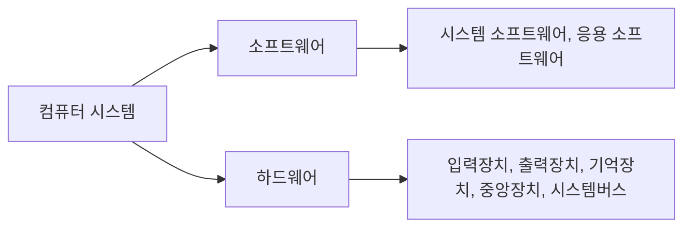
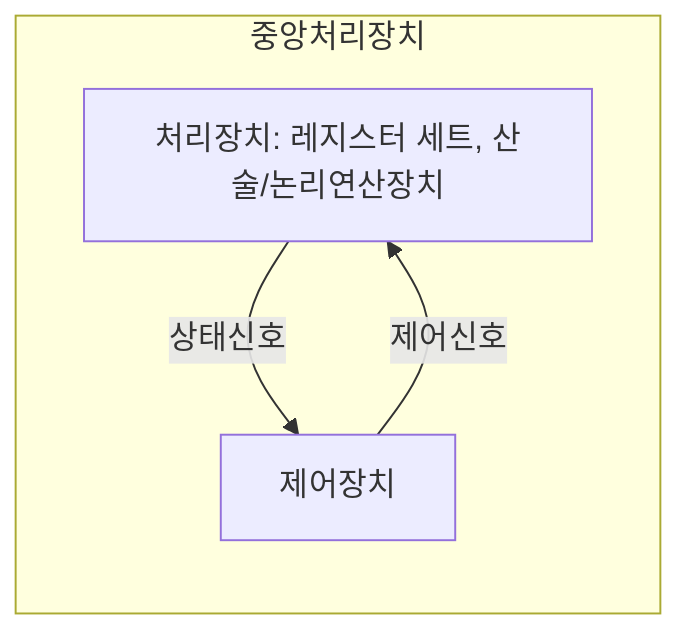
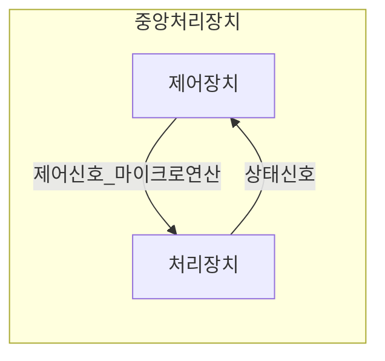
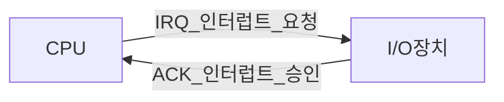
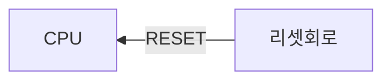

# 컴퓨터시스템구조 - Computer System Structure

[TOC]

## :one: 컴퓨터시스템 개요

### 1. 역사 및 세대별 발전과정

- **시스템**: 그 시스템에 부여된 목적을 달성하기 위해 상호작용하는 구성요소들의 집합

#### - 컴퓨터의 세대별 특징

|    세대     | 제1세대              | 제2세대                     | 제3세대  | 제4세대                                   | 차세대                                           |
| :---------: | -------------------- | --------------------------- | :------- | ----------------------------------------- | ------------------------------------------------ |
|    년도     | 1940                 | 1950                        | 1960     | 1970 ~                                    | 1980 ~                                           |
|    특징     | 진공관               | 트랜지스터                  | 집적회로 | LSI / 마이크로프로세서                    | VLSI                                             |
| 대표 시스템 | ENIAC, EDVAC, UNIVAC | TX-O, IBM 704-709, IBM 7094 | IBM 360  | IBX PC-XT, 애플사의 매킨토시, 미니 컴퓨터 | 대규모 병렬처리 컴퓨터, 광 컴퓨터, 신경망 컴퓨터 |

#### - 제1세대 컴퓨터

**진공관**을 이용한 전자식 컴퓨터

컴퓨터 제어가 **단일 중앙처리장치에 집중**

**어셈블리어(assembly language) 사용**

- **ENIAC(Electronic Numerical Integrator And Calculator)**

  최초의 범용 전자식 컴퓨터

- **EDVAC(Electronic Discrete Variable Automatic Computer)**

  EDVAC의 문제점 해결을 위해 폰 노이만, **프로그램 내장 방식**(stored program concpet) 제안

  10진수가 아닌 **2진수 표현 사용**

  - **프로그램 내장형 컴퓨터**: 프로그램과 데이터를 모두 기억장소 저장 및 실행

- **UNIVAC(UNIVersal Automatic Computer)**

  **최초의 일반 업무용 컴퓨터**

#### - 제2세대 컴퓨터

**트랜지스터 사용**

**고급 프로그래밍 언어 사용**(COBOL, FORTRAN, 등)

큰 용량의 기억장치

입출력 처리장치 같은 처리장치 도입으로 중앙처리장치의 **시간낭비 줄임**

컴파일러, 소프트웨어 라이브러리 등 제공

하드웨어 설계 시 **모듈화 개념 도입**

자기디스크의 개발로 보조기억장치에 대한 **직접 접근 가능**

- **TX-O**

  초기 트랜지스터 컴퓨터
  
- **IBM 704/709**

  704 - 인덱스 리지스터 & 부동 소수점 하드웨어 가짐

  709 - 입출력 처리장치, 데이터 동기화 처리장치, 채널 가짐
  
- **IBM 7094**

  709 버전에서 진공관 -> 트랜지스터

  중앙처리장치에 **산술회로 추가**

  입출력은 주기억장치로 직접 접근하는 입출력 처리장치에 의해 제어

#### - 제3세대 컴퓨터

**집적회로(IC: Integrated Circuit) 등장**

- **IBM 360**

  **직접회로 사용**

  최초로 컴퓨터 계열 개념 도입

  컴퓨터 구조와 구현 분리

#### - 제4세대 컴퓨터

**대규모 집적회로(LSI: Large Scale IC) 사용**

이후 반도체 기술의 발달로 **초대규모 집적회로(VLSI:Ver LSI) 개발**, 현재까지 사용

마이크로프로세서 개발(컴퓨터의 주요 구성요소들을 하나의 반도체 칩으로 모두 집적)

개인용 컴퓨터 보급, 업무 효율성을 위해 자동화

#### - 차세대 컴퓨터

- **대규모 병렬처리 컴퓨터(MPP: Massively Parallel Processing computer)**

  **병렬처리기법**(중복된 하드웨어를 효율적으로 활용하는 방법) 도입, 대규모의 병렬처리 가능

  **상호연결망**(interconnection network) 연결, 상호 협동적인 직업 수행
- **광 컴퓨터(optical computer)**

  빛의 속도가 전자의 속도보다 빠르다는 관점에서 착안
- **신경망 컴퓨터(neural-net computer)**

  폰 노이만의 프로그램 내장형 컴퓨터 구조의 문제점 해결방법

  감각정보처리를 모방한 컴퓨터 구조


### 2. 컴퓨터 기본구조

#### - 구성요소



- **입력장치, 출력장치**

- **기억장치**

  - **주기억장치**

    중앙처리장치가 처리할 데이터와 명령어들을 저장, 대부분 DRAM 구성
  - **캐시**

    주기억장치와 중앙처리장치 사이에 위치

    데이터를 중앙처리에 빨리 전달, 대부분 SRAM 구성

  - **보조기억장치**

    대량의 데이터 저장

    전원이 꺼져도 후에 사용할수 있음

- **중앙처리장치**

  실제 연산 수행, 제어작용

- **시스템버스**

  장치 사이 통신 가능하게 해 주는 통신 선로

  주소버스, 데이터버스, 제어버스

### 3. 컴퓨터 분류

#### - 처리성능과 규모에 따른 분류

1. **마이크로컴퓨터**

   단일 칩 마이크로 컴퓨터

   PC(Personal Computer)

   워크스테이션

2. **미니컴퓨터**

   서버 등장으로 도태

3. **메인프레임 컴퓨터**

   범용성 강조

4. **슈퍼컴퓨터**

   병렬처리 가능

#### - 구조에 따른 분류

1. **파이프라인 슈퍼컴퓨터**

   고속의 백터 계산

2. **대규모 병렬처리 컴퓨터**

   중앙처리장치의 계산속도의 한계 뛰어넘을 수 있을 컴퓨터으로 주목

3. **분산컴퓨팅**

   인터넷에 연결된 여러 컴퓨터들의 처리 능력을 이용하여 거대한 계산 문제를 해결하려는 분산처리 모델

4. **클라우드컴퓨팅**

   집적·공유된 정보통신기기, 정보통신설비, 소프트웨어 등 정보통신자원을 이용자의 요구나 수요 변화에 따라 

   정보통신망을 통하여 신축적으로 이용할 수 있도록 하는 정보처리체계

---

## :two: 데이터 표현 및 연산

데이터는 수를 나타내는 수치 데이터와 기타 정보를 나타내기 위한 비수치 데이터가 있음

- **데이터를 컴퓨터에 표현할 때**

  기억장치의 용량을 적게 사용하는지

  데이터 처리에 편리한지

  데이터 통신의 경우, 데이터의 오류 검출/수정 가능한지

  고려해야 함

### 1. 진법과 진법변환

#### - 진법

수를 숫자로서 나타내는 방법

숫자의 위치에 따라 가중치 부여

- **r진법**

  기수가 $r(r\ge2)$인 경우의 진법

  r개의 숫자(0, 1, 2, ... r-1)로 수 표현

- **r진수**

  r진법으로 표현된 수

  r진수임을 나타내기 위해 r진수 오른쪽 아래에 기수 r 표시

##### - 진법 종류

- **10진법**

  10개의 숫자로 수 표현

- **2진법**

  2개의 숫자(0, 1)로 수 표현

r진법으로 표현된 r진수 N은 정수부분이 n자리, 소수점 이하 부분이 m자리라고 할 때

$N=(a_{n-1}a_{n-2}...a_0\cdot a_{-1}a_{-2}...a_{-m})_r$

$\;\;\;\;=a_{n-1}r^{n-1}+a_{n-2}r^{n-2}+...+a_0r^0+a_{-1}r^{-1}+a_{-2}r^{-2}+...+a_{-m}r^{-m}$

$\;\;\;\; = {\displaystyle \sum_{k=-m}^{n-1}a_kr^k}$

$\;\;\;\;(0\le a_k \le r)$

#### - 진법 변환

##### - r진수의 10진수 변환

ex 1) 2진수 1011.101 => 10진수 변환

$1011.101_2 = 1\times2^3+1\times2^1+1\times2^0+1\times2^{-1}+1\times2^{-3}$

$\;\;\;\;\;\;\;\;\;\;\;\;\;\;\;\;=8+2+0.5+0.125$

$\;\;\;\;\;\;\;\;\;\;\;\;\;\;\;\;=11.625$

ex 2) 16진수 9AB.C => 10진수

$9AB.C_{16} = 9\times16^2+11\times16^1+12\times16^0+13\times16^{-1}$

$\;\;\;\;\;\;\;\;\;\;\;\;\;\;\;\;=2304+160+11+0.75$

$\;\;\;\;\;\;\;\;\;\;\;\;\;\;\;\;=2475.75$

##### - 10진수의 r진법 변환

ex 1) 10진수 28.125 => 2진수

$(28)_{10}=(11100)_2$

$(0.125)_{10}=(0.001)_2$

$\therefore\;(28.125)_{10}=(11100.001)_2$

ex 2) 10진수 1127.025 => 16진수

$(1127)_{10}=(467)_{16}$

$(0.025)_{10}=(0.06...)_{16}$

$\therefore\;(1127.025)_{10}=(467.06...)_{16}$

##### - 2진수와 $2^n$진수의 상호 변환

2진수의 각 비트를 소수점을 중심으로 

2비트씩 묶으면 4진법으로, 3비트씩 묶으면 8진수로, 4비트씩 묶으면 16진수로 대응시켜 변환

##### - $2^n$진수$(n \ge 2)$를 2진수로 변환

$2^n$진수의 각 자리의 수에 대응하는 n비트의 2진수로 모두 바꾸면 됨

##### - 기타 변환

r진수를 s진수로 변환하는 경우(단, $r \ne 10,\;s\ne10$)는 먼저 r진수를 10진수로 변환 후, 다시 s진수로 변환

### 2. 보수

#### - 보수체계

n진수 N은 r의 보수(r's complement)와 (r-1)의 보수(r-1's complement)가 있음

2진수는 2의 보수, 1의 보수가 있음 / 10진수는 10의 보수, 9의 보수가 있음

##### - r의 보수

정수부분이 n개의 자리로 구성된 r진수 N에 대한 r의 보수는 다음과 같이 정의

$N$에 대한 $r$의 보수$=\begin{cases}r^n-N,\;N\ne0\\0,\;\;\;\;N=0\end{cases}$

ex) 10진수 35.34의 10의 보수 => $10^2-35.34=64.66$

​	  2진수 110111의 2의 보수 => $2^6-(110111)_2=(1000000-110111)_2=001001_2$

##### - (r-1)의 보수

정수부분이 n개의 자리로 구성되고 소수점 아래가 m개의 자리로 구성된 r진수 N에 대한 (r-1)의 보수는 다음과 같이 정의

$N$에 대한 $(r-1)$의 보수$=r^n-r^{-m}-N$

ex) 10진수 35.34의 9의 보수 => $10^2 - 10^{-3}-35.34=99.999-35.34=64.659$

​	  2진수

#### - 보수를 이용한 연산

### 3. 데이터의 표현

#### - 정수표현

#### - 부동소수점표현

#### - 문자표현 및 코드체계

### 4. 연산

#### - 산술연산

진수 r인 수에 대한 산술연산은 10진수의 산술연산과 같음

- **가산**

  $11001+11100=110101$

- **감산**

  $11001-01100=01101$

- **승산**

  $1101\times 11=100111$

- **제산**

  $1000\div111=몫:1000\;나머지: 101$

#### - 논리린연산

#### - 비트연산

---

## :three: 디지털 논리회로

### 1. 부울대수 및 논리게이트

#### - 부울대수

#### - 부울함수의 간략화

#### - 논리게이트 - AND, OR, NOT, XOR, NAND, NOR 등

#### - 논리 회로(logic diagram)

### 2. 조합 논리회로

#### - 가산기

#### - 멀티플렉서, 디멀티플렉서

#### - 인코더, 디코더

### 3. 순차 논리회로

#### - 플립플롭

#### - 레지스터

#### - 카운터

#### - 메모리셀

---

## :four: 중앙처리장치(CPU: Central Processing Unit)의 구조와 기능

### 1. CPU 구성요소

컴퓨터에서 명령어 수행, 데이터 처리

프로그램이 수행되는 전반적인 과정 제어

크게 처리장치 & 제어장치로 나뉨



#### - 처리장치

데이터를 처리하는 연산 실행

##### - 처리장치 구성

연산장치와 레지스터들로 구성

- **연산장치(ALU: Arithmetic and Logic Unit)**

  산술/논리연산장치

  산술연산, 논리연산, 비트 연산 등의 연산 수행

  독립적 데이터 처리 수행 불가 -> 데이터 처리 위해 반드시 레지스터 조합 필요

- **레지스터**

  연산에 사용되는 데이터 저장

  연산 결과 저장

##### - 처리장치 구성요소

- 구성요소
  1. 여러개의 레지스터(레지스터 세트)
  2. 산술/논리연산장치(ALU)
  3. 내부버스(internal bus)

##### - 산술/논리장치 (산술/논리연산장치) (ALU)

산술연산회로 & 논리연산회 결합으로 구성

- **산술연산회로**

  가장 기본적인 요소 병렬가산기

  여러 개의 전자가산기 회로를 연속적으로 연결시켜 만듦

  병렬가산기로 들어가는 제어입력값을 선택해 여러 형태의 산술연산 실행

  - 산술연산 종류	/	$F=A+Y+C_{in}$

  | $S_1$ | $S_0$ |      $Y$       | $C_{in}=0$         | $C_{in}=1$                  |
  | :---: | :---: | :------------: | ------------------ | --------------------------- |
  |   0   |   0   |     모두 0     | $F=A$ (전송)       | $F=A+1$ (증가)              |
  |   0   |   1   |      $B$       | $F=A+B$ (가산)     | $F=A+B+1$                   |
  |   1   |   0   | $\overline{B}$ | $F=A+\overline{B}$ | $F=A+\overline{B}+1$ (감산) |
  |   1   |   1   |     모두 1     | $F=A-1$ (감소)     | $F=A$ (전송)                |

- **논리연산회로**

  레지스터의 각 트를 각 독립된 2진 변수로 간주, 비트별 연산 실행

  | $S_1$ | $S_0$ | 출력              | 연산  |
  | :---: | :---: | ----------------- | ----- |
  |   0   |   0   | $F= R1 \land R2$  | $AND$ |
  |   0   |   1   | $F=A \lor B$      | $OR$  |
  |   1   |   0   | $F=A \oplus B$    | $XOR$ |
  |   1   |   1   | $F= \overline{A}$ | $NOT$ |

- **산술/논리연산장치(ALU)**

  | $S_2$ | $S_1$ | $S_0$ | $C_{in}$ | 연산                 | 기능                        |
  | :---: | :---: | :---: | :------: | -------------------- | --------------------------- |
  |   0   |   0   |   0   |    0     | $F=A$                | $A$의 전송                  |
  |   0   |   0   |   0   |    1     | $F=A+1$              | $A$에 1 더하기              |
  |   0   |   0   |   1   |    0     | $F=A+B$              | $+$                         |
  |   0   |   0   |   1   |    1     | $F=A+B+1$            | 캐리값 1과 더하기           |
  |   0   |   1   |   0   |    0     | $F=A+\overline{B}$   | $A$에 $B$의 1의 보수 더하기 |
  |   0   |   1   |   0   |    1     | $F=A+\overline{B}+1$ | $-$                         |
  |   0   |   1   |   1   |    0     | $F=A-1$              | $A$에서 1 뺴기              |
  |   0   |   1   |   1   |    1     | $F=A$                | $A$의 전송                  |
  |   1   |   0   |   0   |    X     | $F=A \land B$        | $AND$                       |
  |   1   |   0   |   1   |    X     | $F=A \lor B$         | $OR$                        |
  |   1   |   1   |   0   |    X     | $F= A \oplus B$      | $XOR$                       |
  |   1   |   1   |   1   |    X     | $F=\overline{A}$     | $A$의 보수                  |

- **상태 레지스터**

  ALU(산술/논리연산장치)에서 산술연산 수행 후, 연산결과에 의해 나타는 상태값 저장

  $C(carry$ $bit)$	\	$S(sign$ $bit)$	\	$Z(zeor$ $bit)$	\	$V(overflow$ $bit)$

- **시프터**

  | $H_1$ | $H_0$ | 연산                   | 기능                     |
  | ----- | ----- | ---------------------- | ------------------------ |
  | 0     | 0     | $S \leftarrow F$       | 시프트 없이 전송         |
  | 0     | 1     | $S \leftarrow shr$ $F$ | 오른쪽 시프트하여 전송   |
  | 1     | 0     | $S \leftarrow shl$ $F$ | 왼쪽 시프트하여 전송     |
  | 1     | 1     | $FS \leftarrow 0$      | 모두 출력비트에 0을 전송 |

##### - 제어단어

처리장치에 있는 선택신호: 처리장치 내에서 수행되는 마이크로연산을 선택하는 변수

처리장치의 버스, ALU, 시프터, 도착 레지스터 등을 제어

선택신호, 즉 제어변수가 처리장치 내에서 특정한 마이크로연산 선택

이런 제어변수들의 묶음 => **제어단어(control word)**

- **제어단어를 구성하는 각 필드 (총 16비트)**
  - $A$ 필드: $ALU$로 입력되는 $A$버스 선택(3비트)	/	1, 2, 3
  - $B$ 필드: $ALU$로 입력되는 $B$버스 선택(3비트)	/	4, 5, 6
  - $F$ 필드: $ALU$의 연산 선택(4비트)	/	7, 8, 9, 10
  - $H$ 필드: 시프터의 연산 선택(3비트)	/	11, 12, 13
  - $D$ 필드: 도착 레지스터 선택(3비트)	/	14, 15, 16

| 2진 코드 |   $A$    |   $B$    | $C$  | $F$: $C_{in}=0$    | $F$: $C_{in}=1$ | $H$         |
| :------: | :------: | :------: | :--: | ------------------ | --------------- | ----------- |
|   000    | 외부입력 | 외부입력 | 없음 | $F=A$              | $F=A+1$         | 시프트 없음 |
|   001    |   $R1$   |   $R1$   | $R1$ | $F=A+B$            | $F=A+B+1$       | $SHR$       |
|   010    |   $R2$   |   $R2$   | $R2$ | $F=A+\overline{B}$ | $F=A-B$         | $SHL$       |
|   011    |   $R3$   |   $R3$   | $R3$ | $F=A-1$            | $F=A$           | $bus=0$     |
|   100    |   $R4$   |   $R4$   | $R4$ | $F=A\land B$       | -               | -           |
|   101    |   $R5$   |   $R5$   | $R5$ | $F=A\lor B$        | -               | $ROR$       |
|   110    |   $R6$   |   $R6$   | $R6$ | $F=A\oplus B$      | -               | $ROL$       |
|   111    |   $R7$   |   $R7$   | $R7$ | $F=\overline{A}$   | -               | -           |

ex) $R1 \leftarrow R2-R3$

| 필드         | $A$  | $B$  | $D$  | $F$     | $H$         |
| ------------ | ---- | ---- | ---- | ------- | ----------- |
| **기호**     | $R2$ | $R3$ | $R1$ | $F=A-B$ | 시프트 없음 |
| **2진 코드** | 010  | 011  | 001  | 0101    | 0000        |

#### - 레지스터

##### - 범용 레지스터

여러 가지 연산을 위한 데이터 저장, 주소 저장, 등의 일반적인 목적을 위한 레지스터

CPU 내부에 있는 소규모의 일시적인 기억장치로 프로그램 진행 도중 가까운 시간 내에 사용할 데이터나 연산결과를 **일시적으로 기억시키는 데 사용**

CPU 내부의 레지스터에 데이터를 기억시켜 두고 연산 (메모리로부터 데이터 인출 시 호출시간 많이 걸림)

##### - 특수 레지스터

1. **프로그램 카운터(PC: Program Counter)**

   데이터가 저장되어 있는 기억장치의 주소 지정

   현재 처리하려고 하는 데이터 인출 후, 자동적으로 +1, 다음에 수행해야 할 명령어가 저장된 기억장치주소 지정

   비트수: 기억장치의 용ㅇ량에 따라 결정, CPU가 지정할 수 있는 기억장치의 전체 영역 지정 

   - ex) 기억장치 전체 영역: 256MByte(= $2^{28}$)	=>	PC: 28bit

2. **기억장치주소 레지스터(MAR: Memory Address Register)**

   기억장치주소 일시 저장

3. **스택 포인터(SP: Stack Pointer)**

   스택 주소지정방식에서 사용

   스택 영역의 번지 지정해주는 포인터

   스택 영엉은 실제 데이터가 피신되는 기억장소로서 기억장치에 위치

   비트수: PC와 같은 크기

4. **명령어 레지스터(IR: Instruction Register)**

   프로그램 수행 중, 기억장치로부터 가장 최근에 인출된 명령어 갖고 있음

   비트수: 명령어의 연산코드의 비트수

5. **기억장치 버퍼 레지스터(MBR: Memory Buffer Register)**

   기억장치로 쓰일 데이터나 기억장치로부터 읽힐 데이터 임시 저장

6. **누산기(AC: Accumulator)**

   데이터 일시 저장

   입력장치로부터 데이터 받거나 / 출력장치로 데이터 전송

   산술연산 및 논리연산이 이루어질 경우, 오퍼랜드나 연산결과 일시적으로 기억

   CPU 연산 수행한 후, 그 결과는 반드시 누산기에 저장

#### - 제어장치

연산의 실행순서 결정하는 역할 ==**(:six: 제어장치 참고)**==

#### - 내부버스

**멀티플렉서 & 디코더 이용**

레지스터들 간의 데이터 전송을 위한 공용선로 집합

- 멀티플렉서: 출발 레지스터 선택
- 디코더: 도착 레지스터 선택

### 2. 명령어 사이클

#### - 마이크로 연산

레지스터나 기억장치에 있는 데이터에 대해 이루어지는 기본적인 연산

##### - 레지스터 전송 마이크로연산

한 레지스터에서 다른 레지스터로 2진 데이터 전송하는 연산

ex) $R2 \leftarrow R1$

- $R1$: 출발 레지스터(source register)
- $R2$: 도착 레지스터(destination register)

조건문 표현: $If(T_1=1)$ $then$ $(R2 \leftarrow R1)$	/	$T_1$: 제어장치에서 발생시키는 제어신호

=> 간단하게 $T_1$ : $R2 \leftarrow R1$	/	$T_1=1$일 때만 해당 하드웨어에서 데이터 전송 실행

- 레지스터 전송문에서 사용하는 기본 기호

| 기호              | 의미                                         | 예                                     |
| ----------------- | -------------------------------------------- | -------------------------------------- |
| 영문자(숫자 포함) | 레지스터 표시                                | $AR$, $R2$, $DR$, $IR$                 |
| 괄호              | 레지스터 일부분                              | $R2(1)$, $R2(7:0)$, $AR(L)$            |
| 화살표            | 자료 이동 표시                               | $R1 \leftarrow R2$                     |
| 쉼표              | 동시에 실행되는 2개 이상의 마이크로연산 구분 | $R1 \leftarrow R2$, $R2 \leftarrow R1$ |
| 대괄호            | 메모리에서의 어드레스                        | $DR \leftarrow M[AR]$                  |

##### - 산술 마이크로연산

레지스터 내에의 데이터에 대해 실행되는 산술연산 ($+$, $-$, $+1$, $-1$, 보수연산)

| 기호표시                           | 의미                                         |
| ---------------------------------- | -------------------------------------------- |
| $R0 \leftarrow R1+R2$              | $R1$과 $R2$의 합을 $R0$에 저장               |
| $R2 \leftarrow \overline{R2}$      | $R2$의 보수(1의 보수)를 $R2$에 저장          |
| $R2 \leftarrow \overline{R2}+1$    | $R2$에 2의 보수를 계산 후 저장               |
| $R0 \leftarrow R1+\overline{R2}+1$ | $R1$에 $R2$의 2의 보수를 더한 후 $R0$에 저장 |
| $R1 \leftarrow R1+1$               | $R1$에 1 더함(상승 카운트)                   |
| $R1 \leftarrow R1-1$               | $R1$에 1 뻄(하강 카운트)                     |

##### - 논리 마이크로연산

레지스터 내의 데이터에 대한 비트를 조작하는 연산 ($AND$, $OR$, $XOR$, $NOT$ 연산)

| 기호표시                      | 의미                             |
| ----------------------------- | -------------------------------- |
| $R0 \leftarrow \overline{R1}$ | 비트별 논리적 $NOT$(1의 보수)    |
| $R0 \leftarrow R1 \land R2$   | 비트별 논리적 $AND$(비트 클리어) |
| $R0 \leftarrow R1 \lor R2$    | 비트별 논리적 $OR$(비트 세트)    |
| $R0 \leftarrow R1 \oplus R2$  | 비트별 논리적 $XOR$(비트별 보수) |

##### - 시프트 마이크로연산

레지스터 내의 데이터를 시프트시키는 연산

데이터 측면이동에 사용

시프트 연산을 수행해도 $R2$의 값은 변하지 않음

$shr$이나 $shl$에 대해 입력비트 0으로 가정	/	출력비트 값 버려짐

| 유형          | 기호표시                 | 출발지 $R2$ | 시프트 후: 목적지 $R1$ |
| ------------- | ------------------------ | ----------- | ---------------------- |
| 왼쪽 시프트   | $R1 \leftarrow shl$ $R2$ | 10011110    | 00111100               |
| 오른쪽 시프트 | $R1 \leftarrow shr$ $R2$ | 11100101    | 01110010               |

#### - 명령어 사이클(instruction cycle)

1개의 명령어를 CPU에서 수행하는 데 필요한 전체 수행과정

- **명령어 사이클 종류**
  1. 인출 사이클(fetch cycle)
  2. 실행 사이클(execute cycle)
  3. 간접 사이클(indirect cycle)
  4. 인터럽트 사이클(interrupt cycle)

#### - 명령어 인출 사이클

기억장치에 기억되어 있는 명령어 인출

다음과 같이 세단계로 구성

$T_0\;:\;MAR\leftarrow PC$

$T_1\;:\;MBR\leftarrow M[MAR],\;PC\leftarrow (PC)+1$

$T_2\;:\;IR\leftarrow MAR$

3개의 CPU 클록 시간 필요

#### - 명령어 실행 사이클

명령어 실행하는 단계

명령어 인출과정을 통해, IR 레지스터에 실린 명령어 해독, 해독한 명령어에 따라 필요한 연산 수행

ex) $LOAD$ 명령어의 실행 사이클 동안의 마이크로연산 표현

​		$T_0\;:\;MAR \leftarrow IR(adrs)$

​		$T_1\;:\;MBR\leftarrow M[MAR]$

​		$T_2\;:\;AC\leftarrow MBR$

#### - 간접 사이클

간접주소지정방식을 사용하는 명령어에서 오퍼랜드 부분의 유효주소를 결정하는 데 사용

3개의 클록으로 완성

$T_0\;:\;MAR\leftarrow IR(adrs)$

$T_1\;:\;MBR\leftarrow M[MAR]$

$T_2\;:\;IR\leftarrow MABR$

#### - 인터럽트 사이클

CPU의 정상적인 동작 중에 입출력장치로부터의 인터럽트 처리 요청이 발생했을 때 실행

- **입터럽트**

  CPU가 현재 처리 중인 프로그램 루틴 중단, 다른 동작 수행

$T_0\;:\;MBR\leftarrow PC$

$T_1\;:\;MAR\leftarrow SP,\;PC\leftarrow ISR(adrs)$

$T_2\;:\;M[MAR\leftarrow MBR]$

### 3. 명령어 파이프라이닝

- **파이프라이닝(pipelining)**

  어떤 일을 실행할 때 하나의 일을 여러 단계로 나누어 중첩되게 실행함 
  
  => 성능 높이기

#### - 명령어 파이프라이닝(instruction pipelining)

CPU 처리속도 향상을 위한 방법 중 하나

CPU의 내부 하드웨어를 여러 단계로 나누어 처리하는 기술

##### - 2단계 명령어 파이프라인


| 클록 주기 |  1   |  2   |  3   |  4   |
| :-------: | :--: | :--: | :--: | :--: |
| 명령어 1  | 인출 | 실행 |      |      |
| 명령어 2  |      | 인출 | 실행 |      |
| 명령어 3  |      |      | 인출 | 실행 |
|    ...    |      |      |      | 인출 |

- **명령어 수행 사이클**

  명령어 인출 단계, 명령어 실행단계

명령어 처리속도 2배 향상

두 단계의 처리시간이 항상 동일해야하는 제약 존재

=> 각 단계의 수를 늘려 각 단계의 처리시간을 같게 만드는 방법 있음

단계 세분화로 각 단계 간의 시간 차이 최소화

단계 수 늘려서 단계별 시간 일정, 전체적인 속도 향상

##### - 4단계 명령어 파이프라인


| 클록 주기 |  1   |  2   |  3   |  4   |  5   |  6   |  7   |  8   |
| :-------: | :--: | :--: | :--: | :--: | :--: | :--: | :--: | :--: |
| 명령어 1  |  IF  |  ID  |  OF  |  EX  |      |      |      |      |
| 명령어 2  |      |  IF  |  ID  |  OF  |  EX  |      |      |      |
| 명령어 3  |      |      |  IF  |  ID  |  OF  |  EX  |      |      |
| 명령어 4  |      |      |      |  IF  |  ID  |  OF  |  EX  |      |
|    ...    |      |      |      |      |  IF  |  ID  |  OF  |  EX  |

- **명령어 수행 사이클**

  **IF**: 명령어 인출

  **ID**: 명령어 해독

  **OF**: 오퍼랜드 인출

  **EX**: 실행 단계

두 번째 클록 주기에서부터 명령어 단계 중첩되어 병렬로 처리

최대 4개의 단계 동시 처리

처리속도 향상

##### - 6단계 명령어 파이프라인


| 클록 주기 |  1   |  2   |  3   |  4   |  5   |  6   |  7   |  8   |  9   |  10  |
| :-------: | :--: | :--: | :--: | :--: | :--: | :--: | :--: | :--: | :--: | :--: |
| 명령어 1  |  FI  |  DI  |  CO  |  FO  |  EI  |  WO  |      |      |      |      |
| 명령어 2  |      |  FI  |  DI  |  CO  |  FO  |  EI  |  WO  |      |      |      |
| 명령어 3  |      |      |  FI  |  DI  |  CO  |  FO  |  EI  |  WO  |      |      |
| 명령어 4  |      |      |      |  FI  |  DI  |  CO  |  FO  |  EI  |  WO  |      |
| 명령어 5  |      |      |      |      |  FI  |  DI  |  CO  |  FO  |  EI  |  WO  |
|    ...    |      |      |      |      |      |  FI  |  DI  |  CO  |  FO  |  EI  |

- **명령어 수행 사이클**

  **FI**: 명령어 인출(Fetch Instruction)

  **DI**: 명령어 해독(Decode Instruction)

  **CO**: 오퍼랜드 계산(Calculate Operand)

  **FO**: 오퍼핸드 인출(Fetch Operand)

  **EI**: 명령어 실행(Execute Instruction)

  **WO**: 오퍼랜드 저장(Write Operand)

최대 6개 명령어 단계 동시 처리

처리속도 매우 향상

---

## :five: 컴퓨터 명령어

### 1. 명령어 세트

- **명령어 집합**(instruction set): 컴퓨터에서 사용할 수 있는 명령어의 집합

  모든 컴퓨터는 자신의 명령어 집합 가지고 있음

  컴퓨터의 구조적인 특성 나타내는 가장 중요한 정보

- 명령어 구성

  명령어: 필드(field)라는 비트 그룹

  **연산코드(operation code) & 오퍼랜드(operand) 필드**로 나눠짐

#### - 명령어 형식

##### - 기억장소에 따른 분류

- **누산기**(AC)를 이용한 명령어 형식 

  함수연산기능의 명령어를 수행할 때 오퍼랜드들 중 하나가 누산기에 기억되도록 하는 컴퓨터 구조에서 사용됨

  ex) $ADD$ $X$	;	$AC \leftarrow AC + M[X]$

- **다중 레지스터**를 이용한 명령어 형식

  중앙처리장치 내에 여러 개의 레지스터를 가지고 있는 컴퓨터

  ex) $ADD$ $R1$, $R2$, $R3$	;	$R3 \leftarrow R2 + R2$

- **스택 구조**를 이용한 명령어 형식

  연산에 필요한 오퍼랜드들, 연산 결과를 기억장치 스택에 기억

  - **스택**: 후입선출(LIFO: Last In First Out)

  ex) $ADD$	;	$TOS \leftarrow TOS + TOS_{-1}$

##### - 오퍼랜드의 수에 따른 분류

-  **0-주소 명령어**

   기억장치 스택 사용

   주소 필드 사용 X

   명령어 길이 가장 짧음, 기억공간 적게 차지

   비효율적

   ex) $PUSH$ $A$	;	$TOS \leftarrow M[A]$

   ​	$PUSH$ $B$	  ;	$TOS \leftarrow M[B]$

   ​	$ADD$			 ;	$TOS \leftarrow TOS + TOS_{-1}$

   ​	$PUSH$ $C$ 	 ;	$TOS \leftarrow M[C]$

   ​	$MUL$ 			;	$TOS \leftarrow TOS \times TOS_{-1}$

   ​	$POP$ $X$		 ;	$M[X] \leftarrow TOS$

- **1-주소 명령어**

  오퍼랜드 1개

  명령어 수 더 증가

  - **누산기 레지스터**

    기억장치로부터 오퍼랜드 가져오거나 연산결과 저장하기 위한 임시적인 장소

  ex) $LOAD$ $A$	 ;	$AC \leftarrow M[A]$

  ​	$ADD$ $B$		  ;	$AC \leftarrow AC + M[B]$

  ​	$STORE$ $X$	;	$M[X] \leftarrow AC$

  ​	$LOAD$ $C$	   ;	$AC \leftarrow M[C]$

  ​	$MUL$ $X$		 ;	$AC \leftarrow AC + M[X]$

  ​	$STORE$ $X$	;	$M[X] \leftarrow AC$

- **2-주소 명령어**

  오퍼랜드 2개

  상용업 컴퓨터에서 가장 많이 사용

  3-주소 명령어보다 길이 짧아짐, 명령어 수 증가

  ex) $MOVE$ $A$, $R1$	;	$R1 \leftarrow M[A]$

  ​	$ADD$ $B$, $R1$		  ;	$R1 \leftarrow M[B]$

  ​	$MUL$ $R1$, $C$		 ;	$R1 \leftarrow R1 + M[C]$

  ​	$MOVE$ $R1$, $X$	 ;	$M[A] \leftarrow R1$

- **3-주소 명령어**

  오퍼랜드 3개

  산술식 프로그램화 시, 길이 짧아짐

  비트수가 다른 주소 명령어 형식보다 많이 필요함

  ex) $ADD$ $A$, $B$, $R1$	;	$R1 \leftarrow M[A] + M[B]$

  ​	$MUL$ $R1$, $C$, $X$	 ;	$M[X] \leftarrow R1 \times M[C]$

### 2. 주소 지정 방식

- **주소지정방식**

  프로그램 수행 시 오퍼랜드 지정하는 방식

  오퍼랜드 실제 참조 전에, 명령어의 주소 필드 병경 혹은 해석하는 규칙을 지정하는 형식

- **유효주소**

  주소지정방식의 각 규칙에 의해 정해지는 **오퍼랜드의 실제 주소**

- 주소를 실제 깅거공간과 연관시키는 방법에 따라 분류

  - **절대주소**

    임의의 기억장소에 대한 유효주소로 0, 1, 2, 3, ...의 순서로 처음부터 차례대로 지정

  - **상대주소**
  
    기준주소를 기준으로 상대적으로 얼마만큼 떨어져 있는지 변위(Offset)로 표현하는 주소
    
    절대주소로 변환해야만 실제 데이터에 접근 가능

#### - 묵시적(암시적) 주소지정방식 (의미주소지정방식) (스택 주소지정방식)

*0-주소 명령어 형식*

명령 실행에 필요한 데이터의 위치를 지정하지 않고 누산기나 스택의 데이터를 묵시적으로 지정 및 사용

ex) $ADD$	;	$TOS \leftarrow TOS + TOS_{-1}$

#### - 즉치 주소지정방식

*0-주소 명령어 형식*

명령어 자체 내에 오퍼랜드 지정

ex) $LDI$ $100$, $R1$	;	$R1 \leftarrow 100$

#### - 직접 주소지정방식

*1-주소 명령어 형식*

명령어의 주소 필드에 직접 오퍼랜드의 주소 저장

ex) $LDA$ $ADRS$	;	$AC \leftarrow M[ADRS]$

#### - 간접 주소지정방식

*2-주소 명령어 형식*

명령어의 주소 필드에 유효주소가 저장되어 있는 기억장치주소 기억

기억장치로부터 명령어 가지오기-> 주소 부분 이용하여 다시 기억장치에 접근, 유효주소 읽음

ex) $LDA[ADRS]$	;	$R1 \leftarrow M[M[ADRS]]$

#### - 레지스터 직접주소지정방식

*1-주소 명령어 형식*

오퍼랜드가 레지스터에 저장

ex) $LDA$ $R1$	;	$AC \leftarrow R1$

#### - 레지스터 간접주소지정방식

*2-주소 명령어 형식*

레지스터에 실제 오퍼랜드가 저장된 기억장치의 주소값 저장

ex) $LAD$ $(R1)$	;	$AC \leftarrow M[R1]$

#### - 변위 주소지정방식

*3-주소 명령어 형식*

두 개의 조수부를 두고 각각 주소값, 레지스터 지정하여 사용

**유효주소 = 명령어 주소 부분의 내용 + 변위 값**

##### - 상대주소지정방식

특정 레지스터의 내용에 명령어 주소 필드값(PC: Program Counter)을 더하는 방식

유효주소 = 명령어 주소 부분의 내용 + PC의 내용

ex) $AC \leftarrow M[R1]$	;	$AC \leftarrow M[ADRS + PC]$

##### - 인덱스된 주소지정방식

특정 레지스터의 내용에 인덱스 레지스터의 내용을 더하는 방식

ex) $LDA$ $ADRS(R1)$	;	$AC \leftarrow M[ADRS + R1]$

##### - 베이스 주소지정방식

특정 레지스터의 내용에 **베이스 레지스터** 값을 더하는 방식

ex) $LDA$ $ADRS(RBX1)$	;	$AC \leftarrow M[ADRS + RBX1]$

---

## :six: 제어장치

### 1. 제어장치의 기능

특정한 데이터 연산을 실행할 수 있도록 처리장치에 마이크로연산을 구동시키는 여러 신호 제공하는 장치.

- **제어장치 & 처리장치 관계**



​	외부신호(컴퓨터 명령) --> 제어장치

​	입력 데이터--> 처리장치 --> 출력 데이터

### 2. 제어장치의 구조

- **제어장치 구성요소**
  1. 명령어 레지스터(IR)
  2. 명령어 해독기
  3. 주소처리기
  4. 순서제어기

- **명령어 수행과정**

  1. PC(Program Counter)에 저장된 주소 --> 메모리 주소 레지스터(MAR) 보내기

  2. 메모리버퍼 레지스터(MAR)에 저장된 주소에 있는 기억장치의 명령어 --> 메모리 버퍼 레지스터(MBR)로 읽어오기

     PC +1

     명령어 수행을 위해 읽어 온 명령어 명령어 레지스터(IR)에 저장

  3. **명령어: 연산코드+오퍼랜드**

     연산코드 --> 명령어 해독기 보내기

     오퍼랜드 --> 주소처리기 보내기

  4. 주소처리기는 MAR를 통해 명령어 수행에 필요한 오퍼랜드 주소/다음 명령어 주소 계산 => 기억장치 접근

  5. 제어신호 발생기: 1~4에 필요한 제어신호와 연산코드 해독, 명령어 수행을 위한 제어신호 발생

     if 명령어=점프 명령어, 즉 기억장치의 주소 참조 명령어

     => 제어신호 발생기는 주소처리기 동작, 다음에 수행될 명령어의 주소 계산

  6. 명령어 레지스터에 있는 명령어 수행 완료

     => 증가된 PC의 내용은 다음에 수행할 명령어 주소 지정 / 점프 명령어, 즉 분기 필요 경우 해당 명령어의 주소 지정

     ​	1~4 반복

- **제어장치 구현**

  - **마이크로프로그램으로 구현한 제어장치**

    제어단어와 같은 제어정보를 특별한 기억장치에 0, 1로 기억시킨 구조

    속도 느림

    융통성 뛰어남, 제어신호 수정 시 기억장치 프로그램만 바꾸면 됨

  - **하드웨어로 구현한 제어장치**

    순서회로와 같은 **게이트와 플립플롭**으로 이루어진 구조

    고속 동작 가능

    융통성 떨어짐, 한 번 만들면 회로 변경 못함

### 3. 명령어 사이클에서의 제어신호

**==:four: 중앙처리장치의 구조와 기능 > 2. 명령어 사이클 참고==**

### 4. 마이크로 프로그램 제어방식

- **마이크로명령어**

  하나/다수 마이크로연산 나타내는 **제어단어** 포함

- **마이크로프로그램**

  순차적인 마이크로명령어들의 집합


- **제어기억장치**

  모든 제어정보를 항상 저장하고 있는 ROM이나 RAM

- **제어주소 레지스터(CAR:Control Address Register)**

  제어기억장치에 있는 마이크로명령어 주소 나타냄

- **제어데이터 레지스터(CDR: Control Data Register)**

  제어기억장치에서 읽어 온 마이크로명령어 저장 (필수 요소 X)

- **다음 주소  생성기(순서기)**

  제어기억장치에서 제어단어를 읽어 내는 순서 결정

- **제어장치 동작**

  1. 임의의 클록 펄스 변화, CAR에 새로운 주소 들어옴

     주소에 있는 26비트의 마이크로명령어 제어기억장치로부터 인출

  2. 처리장치와 멀리플렉서 $MUX1$, $MUX2$의 마이크로연산을 지정하는 마이크로명령어의 제어단어는 CAR의 다음 동작 결정

  3. 제어단어의 제어시노는 $ROM$, $ALU$, 시프터, 멀티플렉서와 같은 조합회로로 전달

     다음 클록의 천이가 일어날 떄까지 진행

  4. 클록의 다음 천이가 일어나면 

     마이크로연산 결과 --> 처리장치의 특정 레지스터로 전송

     해당 상태비트를 새로운 값으로 갱신

     다음 주소 --> CAR로 전송

  5. CAR의 새로운 주소는 

     제어기억장치에서 인출할 다음 마이크로명령어 지정, 다음 클록의 천이 시 수행되도록 함

  6. 1~5 과정을 각 클록의 천이 떄마다 반복

#### - 마이크로 명령어의 형식

총 26비트

- $A$ 필드: 처리장치의 레지스터 중 하나의 출발 레지스터 선택(3비트)
- $B$ 필드: 처리장치의 레지스터 중 다른 하나의 출발 레지스터 선택(3비트)
- $D$ 필드: 처리장치의 레지스터 중 도착 레지스터 선택(3비트)
- $F$ 필드: 처리장치의 $ALU$의 마이크로연산 선택(4비트)
- $H$ 필드: 처리장치의 시프터 마이크로연산 선택(3비트)
- $MUX1$ 필드: 0과 1로서 내부주소/외부주소 선택(1비트)
- $MUX2$ 필드: 상태비트의 값에 따라 CAR 구동(3비트)
- $ADRS$ 피드: $ROM$의 2진 번지에 해당하는 10진 주소(6비트)

| 비트  |  필드  | 기호            | 기능                         |
| :---: | :----: | --------------- | ---------------------------- |
|  1~3  |  $A$   | $INP,\;R1$~$R7$ | 출발 레지스터 선택           |
|  4~6  |  $B$   | $INP,\;R1$~$R7$ | 출발 레지스터 선택           |
|  7~9  |  $D$   | $INP,\;R1$~$R7$ | 도착 레지스터 선택           |
| 10~13 |  $F$   | 아래 표 참고    | $ALU$ 연산                   |
| 14~16 |  $H$   | 아래 표 참고    | 시프트 연산                  |
|  17   | $MUX1$ | $INP,\;EXT$     | $MUX1$ 선택($INT=0,\;EXT=1$) |
| 18~20 | $MUX2$ | 아래 표 참고    | $MUX2$ 선택                  |
| 21~26 | $ADRS$ | 주소            | $ROM$의  단어 선택           |

- $A,\;B$의 $INP$: 외부입력 데이터
- $NONE$: 도착 레지스터를 선택하지 않음
- $MUX1$ 필드의 $INT,\;EXT$: 각각 내부주소, 외부주소

- **산술/논리연산장치(ALU) 연산**

| $S_2$ | $S_1$ | $S_0$ | $C_{in}$ | 연산                 | 기능                        |
| :---: | :---: | :---: | :------: | -------------------- | --------------------------- |
|   0   |   0   |   0   |    0     | $F=A$                | $A$의 전송                  |
|   0   |   0   |   0   |    1     | $F=A+1$              | $A$에 1 더하기              |
|   0   |   0   |   1   |    0     | $F=A+B$              | $+$                         |
|   0   |   0   |   1   |    1     | $F=A+B+1$            | 캐리값 1과 더하기           |
|   0   |   1   |   0   |    0     | $F=A+\overline{B}$   | $A$에 $B$의 1의 보수 더하기 |
|   0   |   1   |   0   |    1     | $F=A+\overline{B}+1$ | $-$                         |
|   0   |   1   |   1   |    0     | $F=A-1$              | $A$에서 1 뺴기              |
|   0   |   1   |   1   |    1     | $F=A$                | $A$의 전송                  |
|   1   |   0   |   0   |    X     | $F=A \land B$        | $AND$                       |
|   1   |   0   |   1   |    X     | $F=A \lor B$         | $OR$                        |
|   1   |   1   |   0   |    X     | $F= A \oplus B$      | $XOR$                       |
|   1   |   1   |   1   |    X     | $F=\overline{A}$     | $A$의 보수                  |

- **시프트 연산**

| $H_1$ | $H_0$ | 연산                   | 기능                     |
| :---: | :---: | ---------------------- | ------------------------ |
|   0   |   0   | $S \leftarrow F$       | 시프트 없이 전송         |
|   0   |   1   | $S \leftarrow shr$ $F$ | 오른쪽 시프트하여 전송   |
|   1   |   0   | $S \leftarrow shl$ $F$ | 왼쪽 시프트하여 전송     |
|   1   |   1   | $FS \leftarrow 0$      | 모두 출력비트에 0을 전송 |

- **$MUX2$의 선택기능** 

| 2진 코드 | 기호   | 기능                                   |
| :------: | ------ | -------------------------------------- |
|   000    | $NEXT$ | $CAR$ 증가(다음 주소로 간다)           |
|   001    | $LAD$  | $CAR$에 주소 적재(무조건 분기)         |
|   010    | $LC$   | 캐리 있으면 적재($C=1$이면 분기)       |
|   011    | $LNC$  | 캐리 없으면 적재($C=0$이면 분기)       |
|   100    | $LZ$   | 제로면 적재($Z=1$이면 분기)            |
|   101    | $LNZ$  | 제로가 아니면 적재($Z=0$이면 분기)     |
|   110    | $LS$   | 부호가 바뀌었으면 적재($S=1$이면 분기) |
|   111    | $LV$   | $overflow$면 적재($V=1$이면 분기)      |

#### - 마이크로 프로그래밍

ex) 마이크로명령어의 예

| 번호 | $CAR$ 주소 | 제어   단어 $A$ | 제어    단어 $B$ | 제어     단어 $D$ | 제어    단어 $F$ | 제어     단어 $H$ | 선택 $MUX1$ | 선택 $MUX2$ | 다음         주소 필드 |
| :--: | :--------: | :-------------: | :--------------: | :---------------: | :--------------: | :---------------: | :---------: | :---------: | :--------------------: |
|  1   |     36     |      $R1$       |       $R2$       |       $R1$        |      $AND$       |       $NSH$       |      -      |   $NEXT$    |           -            |
|      |            |       001       |       010        |        001        |      10000       |        000        |      0      |     000     |         000000         |
|  2   |     40     |      $R3$       |        -         |       $R3$        |      $DEC$       |       $NSH$       |    $INT$    |    $LAD$    |           43           |
|      |            |       011       |       000        |        011        |       0110       |        000        |      0      |     001     |         101011         |
|  3   |     52     |        -        |        -         |       $R4$        |      $TSF$       |      $ZERO$       |    $INT$    |    $LS$     |           37           |
|      |            |       000       |       000        |        100        |       0000       |        011        |      0      |     110     |         100101         |
|  4   |     59     |      $R6$       |       $R7$       |       $R2$        |      $ADD$       |       $NSH$       |    $EXT$    |    $LAD$    |           -            |
|      |            |       110       |       111        |        010        |       0010       |        000        |      1      |     001     |         000000         |

1. $R1 \leftarrow R1 \land R2,\;CAR \leftarrow CAR+1$
2. $R3 \leftarrow R3-1,\;CAR\leftarrow 43$
3. $R4 \leftarrow 0,\;if(S=1)\;then\;(CAR\leftarrow 37)\;else\;(CAR\leftarrow CAR+1)$
4. $R2 \leftarrow R6+R7,\;CAR\leftarrow외부주소$

#### - 마이크로 프로그램 실행

마이크로명령어들로 이루어진 마이크로프로그램은 제어기억장치에 저장

- **마이크로프로그램 루틴(microprogram routine)**

  한 외부주소로 일련의 마이크로명령어를 수행시킨다고 가정, 이런 수행순서로 이루어진 일련의 마이크로 명령어들의 집합

  다른 루틴이 시작되는 새로운 외부주소를 적재하는 마이크로명령어로 끝남

- **외부주소**

  제어기억장치에 있는 마이크로프로그램 루틴의 첫 번째 주소

ex) 마이크로프로그램의 수행동작 예

1. $R3 \leftarrow R1-R2$(이때 $C$와 $Z$에 새로운 값 들어감)
   1. $R1<R2$이면 ($C=0$)	               ;	$R4\leftarrow R4+R1$
   2. $R1>R2$이면($C=0,\;Z=0$)      ;    $R4\leftarrow R4+R2$
   3. $R1=R2$이면($Z=1$)                    ;   $R4\leftarrow R4+1$
2. $Output \leftarrow R4$, 외부주소로 분기

- 레지스터 전송문

  | 주소 | 마이크로연산과 분기조건                                      |
  | :--: | ------------------------------------------------------------ |
  |  20  | $R3 \leftarrow R1-R2,\;CAR\leftarrow CAR+1$                  |
  |  21  | $If(C=1)\;then\;(CAR\leftarrow 23)\;else\;(CAR\leftarrow CAR+1)$ |
  |  22  | $R4\leftarrow R4+R1,\;CAR\leftarrow 26$                      |
  |  23  | $If(Z=0)\;then\;(CAR\leftarrow 25)\;else\;(CAR\leftarrow CAR+1)$ |
  |  24  | $R4\leftarrow R4+1,\;CAR\leftarrow 26$                       |
  |  25  | $R4\leftarrow R4+R2,\;CAR\leftarrow CAR+1$                   |
  |  26  | $출력\leftarrow R4,\;CAR\leftarrow 외부주소$                 |

- 기호 마이크로프로그램

  | 주소 | $A$  | $B$  |  $D$   |  $F$  |  $H$  | $MUX1$ | $MUX2$ | 다음 주소 필드 |
  | :--: | :--: | :--: | :----: | :---: | :---: | :----: | :----: | :------------: |
  |  20  | $R1$ | $R2$ |  $R3$  | $SUB$ | $NSH$ |   -    | $NEXT$ |       -        |
  |  21  |  -   |  -   | $NONE$ | $TSF$ | $NSH$ | $INT$  |  $LC$  |       23       |
  |  22  | $R4$ | $R1$ |  $R4$  | $ADD$ | $NSH$ | $INT$  | $LAD$  |       26       |
  |  23  |  -   |  -   | $NONE$ | $TSF$ | $NSH$ | $INT$  | $LNZ$  |       25       |
  |  24  | $R4$ |  -   |  $R4$  | $INC$ | $NSH$ | $INT$  | $LAD$  |       26       |
  |  25  | $R4$ | $R2$ |  $R4$  | $ADD$ | $NSH$ |   -    | $NEXT$ |       -        |
  |  26  | $R4$ |  -   | $NONE$ | $TSF$ | $NSH$ | $INT$  | $LAD$  |       -        |

- 2진 마이크로프로그램

  |  주소  | $A$  | $B$  | $D$  | $F$  | $H$  | $MUX1$ | $MUX2$ | 다음 주소 필드 |
  | :----: | :--: | :--: | :--: | :--: | :--: | :----: | :----: | :------------: |
  | 010100 | 001  | 010  | 011  | 0101 | 000  |   0    |  000   |     000000     |
  | 010101 | 000  | 000  | 000  | 0000 | 000  |   0    |  010   |     010111     |
  | 010110 | 100  | 001  | 100  | 0010 | 000  |   0    |  001   |     011010     |
  | 010111 |  -   |  -   | 000  | 0000 | 000  |   0    |  101   |     011001     |
  | 011000 | 100  |  -   | 100  | 0001 | 000  |   0    |  001   |     011010     |
  | 011001 | 100  | 010  | 100  | 0010 | 000  |   0    |  000   |     000000     |
  | 011010 | 100  |  -   | 000  | 0000 | 000  |   1    |  001   |     000000     |

- **펌웨어(fireware)**

  마이크로프로그램이 하드웨어와 소프트웨어의 중간 정도임을 의미

### 5. 하드와이어드(hardwired) 제어

주어진 시간에 처리장치에서 수행할 마이크로연산을 결정해 주는 제어상태를 갖는 순서회로

디코더 존재, 제어장치 중심으로 명령어 레지스터와 입력된 명령어 해독 가능

명령어 레지스터에 들어온 연산코드 -> 디코더에서 해독된 후 제어장치에 입력

- **시간발생기(timing generator)**

  클록을 입력으로 받아 수행

- **제어신호**

  입력 신호가 제어장치의 순서회로를 거쳐 출력되는 신호

#### - 제어장치의 구현

##### - 상태 플립플롭을 이용한 제어방식

순서제어회로의 각 상태별로 각 1개의 플립플롭 할당

가장 많은 수의 플립플롭 사용하는 순서회로

상태 수 증가, 하드웨어적으로 복잡

상태도에서 바로 설계, 매우 간편

##### - 순서 레지스터와 디코더를 이용편한 제어방식

- **레지스터**: 제어상태의 순서 정하기

- **디코더**: 하나만 출력되도록 함

---

## :seven: 기억장치

### 1. 기억장치 개요

#### - 기억장치 종류 및 특성

##### - 참조 지역성

- **지역성의 원리(principle of locality)**

  프로그램이 어떤 일정 시간 동안 주소 공간(address space) 내의 비교적 작은 부분만 반복적으로 접근 및 수행하게 되는 특성

- **시간적 지역성(temporal locality)**

  어떤 내용이 한번 참조되면 곧바로 다시 참조되기 쉬움

- **공간적 지역성(spatial locality)**

  어떤 내용 참조, 그 내용에 가까운 곳에 있는 다른 내용들이 곧바로 참조되기 쉬움

  대개의 명령어들이 **순차적**으로 접근 => **큰 공간적 지역성**

  레코드나 배열의 요소 접근 시, **공간적 지역성 커짐**

#### - 기억장치의 계층적 구조

1. 레지스터
2. 캐시기억장치
3. 주기억장치
4. 보조기억장치

지역성의 원리 이용을 위해 기억장치를 계층으로 구현

가장 빠른 기억장치와 같은 같은 속도로 접근, 가장 저렴한 기술로 제공할 수 있는 크기의 기억장치를 사용자에게 제공하기 위함

속도와 크기가 다른 기억장치를 여러 층으로 구성

- 레지스터, 캐시기억장치, 주기억장치 => CPU 직접 접근 가능

- 보조기억장치: 먼저 주기억장치에 적재되어야 CPU 접근 가능

상위계층일수록 **접근시간 감소, 접근속도 증가, 비용 증가, 용량 감소**

상위계층, 즉 프로세서에 가까운 게층은 하위계층 기억장치가 기억장치가 기억하고 있는 내용의 일부를 저장

=> 크키가 작으며 데이터 접근속도 빠름

가장 하위계층에는 모든 데이터 저장

- **블록(block)**

  두 계층 간에 전송되는 데이터의 최소단위

- **히트(hit)**

  프로세서가 요구하는 데이터가 상위계층의 어떤 블록에 있을 때

- **미스(miss)**

  사위계층에서 프로세서가 요구하는 데이터를 찾을 수 없을 때

- **히스율(hit ratio)**

  상위계층에서 찾을 수 있는 기억장치 접근비율

- **미스율(miss ratio)**

  상위계층에서 찾을 수 없는 기억장치 접근비율

**궁극적인 목적**: 전체 기억장치 구성 시, 가격은 최소화, 가능한 한 빠른 접근속도와 대용량의 크기 제공

#### - 기억장치의 성능평가 요인

1. **기억용량(capacity)**

2. **접근시간(access time)**

   기억장치에서 데이터 판독/기록하는 데 걸리는 시간

3. **사이클 시간(cycle time)**

   하나의 액세스를 시작한 시간부터 다음 액세스가 시작될 때까지의 시간

4. **기억장치의 대역폭(bandwidth)**

   기억장치의 데이터 처리속도, **데이터 전송률**이라고도 함

5. **가격(cost)**

### 2. 주 기억장치

#### - 주 기억장치의 기능

컴퓨터 시스템에서 주기억장치는 필수적인 하드웨어 요소

- **접근시간 & 기억장치, 대역폭, 기억용량**

  주기억장치의 성능평가에 가장 중요한 요소

- **주기억장치의 접근시간**

  컴퓨터 시스템 성능의 중요한 제한요소

  중앙처리장치의 클록 주기 시간과 비교, 수배에서 수십 배 정도 김
  
  => 두 장치 간의 속도 차이 개선은 컴퓨터 시스템의 전체적 성능 향상에 큰 영향 미침

제한된 주기억장치, 중앙처리장치의 속도 차이 개선, 주기억장치의 용량과 대역폭의 한계 극복 위한 여러 방법 연구 중

#### - RAM의 구조 및 종류

#### - ROM의 구조 및 종류

#### - 기억장치 모듈 설계

주기억장치의 대역폭은 명령어 수행속도의 제한적인 요소

- **주기억장치 대역폭 증가시키는 방법**

  1. 속도가 빠른 기억소자 이용하여 설계
  2. 주기억장치에서 한 번에 읽을 수 있는 단어의 비트수 증가

  => 비용 면에서 한계

  주기억장치의 구조적 개선으로 접근속도 증가 방법 필요

##### - 주기억장치의 구성

- **기억장치모듈(memory module)**

  기억장치와 이를 접근하기 위해 필요한 $MAR$과 $MBR$을 묶어서 구성

하나의 기억장치모듈로 구성된 주기억장치에서 3개의 단어를 읽으면 -> 3개의 기억장치 사이클 필요

##### - 복수모듈기억장치

기억장치모듈을 여러 개 가지고 있는 기억장치

기억장치를 구성하는 모듈 수만큼의 단어를 동시에 접근할 수 있음

기억장치버스의 속도에 따라 하나의 모듈에 버스를 통해 주소를 보내는 동안, 다른 모듈에서는 미리 보낸 주소를 해독해 접근하며, 또 다른 모듈에서는 인출한 데이터를 버스를 통해 외부로 내보내는 일들이 동시에 이루어져서

=> **기억장치의 대역폭** 높일 수 있음

**기억장치버스의 폭**, 즉 버스를 구성하고 있는 데이터선의 수가 많을 때

=> 모든 모듈에 동시에 **병렬** 접근 가능

##### - 기억장치 인터리빙

- **버스 경합(bus contention)**

  1개의 버스를 공유하는 시스템에서 동시에 버스의 사용을 요구하는 경우

- **기억장치충돌(memory conflict)**

  1개 이상의 모듈이 동일한 버스선을 사용하면 데이터들 간의 충돌 발생

- **기억장치 인터리빙(memory interleaving)**

  버스 경합/기억장치충돌 문제 해결

  기억장치를 복수모듈로 구성, 각 모듈이 동시에 접근할 수 있게 하는 방식

#### - 연관기억장치 (내용주소화 기억장치(CAM: Content Addressable Memory))

기억장치에 저장된 데이터를 병렬로 동시에 읽어 원하는 항목을 빠르게 찾음

기억장치에 기억되어 있는 데이터를 이용하여 기억장치에 접근할 수 있음

- **기억장치에 저장된 데이터 접근 방식**

  주소 사용 X

  저장되어 있는 데이터의 내용 참조, 원하는 데이터가 저장되어 있는 단어 찾음

  단어 접근, 원하는 데이터 읽음

#### - 가상기억장치

- **가상기억장치**

  주기억장치와 보조기억장치로 구성된 계층 기억체계

  주기억장치의 기억용량이 부족한 점을 개선하기 위한 기법

보조깅거장치와 같이 기억용량이 큰 기억장치를 마치 주기억장치처럼 사용하는 개념

- **가상주소(VA: Virtual Address)**

  가상기억장치 시스템에서 수행되는 프로그램의 명령어가 사용하는 주소

- **물리주소(PA: Physical Address)**

  주기억장치에 접근하기 위해 실제 주기억장치에 적용하는 주소

##### - 기억공간 및 동작원리

보조기억장치에 있는 데이터는 **블록 단위**로 주기억장칠로 옮김

세그먼트 사용/페이지화된 세그먼트 사용

- **페이지**

  가상기억장치에서 많이 사용되는 블록의 개념

- **히트(hit)**

  중앙처리장치가 접근하고자 하는 단어가 주기억장치에 기억되어 있는 경우

- **페이트 폴트(page fault)**

  주기억장치에 기억되어 있지 않은 경우

- **주기억장치에 히트되었을 시**

  주기억장치 직접 접근 가능

- **페이지 폴트 시**

  주기억장치 접근 불가능, 보조기억장치에 접근

  필요한 데이터 읽어 주기억장치에 기억

  주기억장치에 접근

- **만약 주기억장치의 데이터가 가득 차 있을 시**

  주기억장치 내에 있는 페이지 중 하나인 **희생 페이지** 선택

  보조기억장치에 있는 필요한 데이터가 포함된 **페이지 교환**

  주기억장치에 접근

- **희생 페이지(victim page)**

  주기억장치에서 이후에 가장 사용되지 않는 페이지

- **페이지 교환(page replacement)**

  희생 페이지 선택, 데이터가 저장되어 있는 보조기억장치의 페이지와 교환

### 3. 캐시 기억장치

주기억장치보다 속도가 빠른 기억소자들로 구성

중앙처리장치와 주기억장치 간의 속도 차이 줄이는 역할

주기억장치보다 가격 높음, 기억용량 매우 적음

중앙처리장치와 주기억장치 사이에 위치


#### - 동작원리

중앙처리장치가 주기억장치에 있는 데이터를 캐시기억장치에 접근하려면 데이터를 미리 캐시기억장치로 옯겨야 함

=> 기억장치 접근에 대한 **지역성의 원리**로 가능

주기억장치에서 캐시기억장치로 단어를 옮길 때, 단어의 주위에 있는 단어들도 함께 옮김	/	단위: 블록

접근의 지역성 기초로 함

- **히트**

  접근하고자 하는 단어가 캐시기억장치에 저장되어 있는 경우

- **미스**

  저장되어 있지 않은 경우

#### - 사상(mapping) 방법

- **사상(mapping)**: 캐시기억장치와 주기억장치 사이의 데이터 이동
- 방법
  1. **직접사상(direct mapping)**

     주기억장치의 블록이 캐쉬의 지정된 라인으로만 대응

     간단, 저렵한 비용

     특정 블록에 대응되는 캐쉬 라인이 한 개라는 단점(적중률 저하 우려)

  2. **연관사상(associative mapping)**

     주기억장치의 블록이 캐쉬에 어느 라인으로든 적재가 가능함

     빠른 검색을 위해 모든 태그들을 병렬로 검사

     => 복잡한 회로 요구, 높은 비용

  3. **집합-연관사상 (세트-연관사상) (set-associative mapping)**

     직접 사상의 장점 + 연관 사상의 장점

     - 세트의 위치 선택 => 직접 사상 방식

     - 집합 내의 라인 선택 => 연관 사상 방식

#### - 쓰기정책 - write-through, write-back

중앙처리장치는 프로그램을 수행하는 동안 수행 결과를 캐시에 쓰는 경우 존재, 캐시에 쓰기가 이루어졌을 때는 주기억장치의 내용도 갱신되어야 함

- **캐시에 기록하는 시점에 따라**
  1. write-through
  2. write-back

##### - write-through

캐시에 기록함과 동시에 주기억장치에도 기록하는 가장 일반적인 방식

항상 주기억장치의 내용과 캐시의 내용 일치

주기억 장치의 내용이 항상 최근의 데이터 유지

기억장치 접근이 빈번함

##### - write-back

쓰기 동작 동안에는 캐시의 내용만 갱신, 차후에 캐시의 내용이 캐시에서 제거될 때 주기억장치에 기록

캐시와 주기억장치의 내용이 일치하지 않는 경우 발생

중앙처리장치가 프로그램을 수행하는 중간에는 연산 데이터가 계속 변경될 수 있으므로

=> 입출력장치의 기억장치에 대한 접근은 항상 캐시를 통해야 함

#### - 교체 알고리즘

캐시가 꽉 차 있는 상태에서 중앙처리장치가 캐시에 접근하여 원하는 데이터 블록을 찾을 수 없을 때는 캐시의 내용 중 일부를 삭제하고 새로운 데이터 블록을 주기억장치에서 가져와야 함

- **교체 알고리즘**

  캐시의 내용을 교체하는 방식

##### - FIFO(First In First Out)

먼저 들어온 내용을 먼저 제거하는 방식

##### - LRU(Least Recently Used)

최근에 사용되지 않은 내용을 먼저 제거하는 방식

사용하지 않은 채로 가장 오래 있었던 블록 제거

높은 적중률로 가장 효과적

##### - LFU(Lest Frequently Used)

캐시의 각 워드에 카운터를 두고 접근할 때마다 카운터 증가, 제거 시 카운트값이 가장 적은 블록 제거

#### - 성능 개선효과

CPU 칩 내부에 있는 L1 캐시 말고도 CPU 외부에 있는 L2캐시를 둬서 성능 개선

L은 level을 뜻함

L1은 CPU 내부에 있기에 읽고 쓰는 직업 빠르지만 용량 작음

=> CPU 외부에 속도는 느리지만 용량이 더 큰 L2 설치

---

## :eight: 보조기억장치

당장 필요하지 않지만 필요할 때 주기억장치로 옮겨 사용할 수 있는 자료를 저장하는 장치

### 1. 자기디스크

#### - 디스크 구조 및 용어

- **자기디스크**

  금속이나 플라스틱으로 만들어진 **원형판(platter)**을 자화된 물질로 코팅한 기억매체

데이터 전송은 **블록 단위**

일반적으로 한 블록 크기는 한 트랙보다 작음

#### - 디스크 접근 시간

디스크에서 해당 데이터를 찾기 위한 **탐색 시간, 회전 지연시간, 전송시간의 합**

일반적으로 이동헤드 디스크에서는 탐색 시간이 가장 많이 걸림

### 2. 자기테이프

디스크에서처럼 데이터는 **물리적 레코드**라고 불리는 연속적인 블록 단위로 읽기연산과 쓰기연산 실행됨

블록들은 일정한 크기의 블록 간 간격**(IBG: Inter-Block Gap)**에 의해 분리됨

IBG 많아짐 => 테이프의 데이터 저장 효율 작아짐

### 3. 광기억장치

#### - 광기억장치 특성

빛을 이용한 보조기억장치

컴팩트 디스크 디지털 오디오 시스템(compact disk digital audio system) 기술을 컴퓨터 데이터 저장장치에 응용한 장치

정보저장용량이 매우 큼 => 멀티미디어 응용분야에서 사용 증대

#### - 광기억장치 종류

- **CD(Compact Disk)**

  주로 디지털화된 음향정보 저장

- **CD-ROM**

  CD보다 재생장치가 좀 더 정교, 오류 수정 코드 가짐

- **CD-R**

  한 번 데이터를 기록하면 읽기만 가능한 디스크

- **CD-RW**

  재기록이 가능한 CD

- **DVD(Digital Video Disk)**

  영상 저장매체, CD의 6~8배 용량

##### - CD-ROM으로부터 데이터 읽는 방법

1. 등선속도(CLV: Constant Linear Velocity) 방식
2. 등각속도(CAV: Constant Angualr Velocity) 방식

### 4. 레이드(RAID)

#### - 레이드(RAID) 개요

- **SLED(Single Large Expensive Disk)**

  현재 대형 컴퓨터에서 사용되고 있는 고가의 대용량 디스크 시스템

SLED를 저가의 작은 디스크 배역로 대체하기 위해 **RAID(Redundant Arrays of Inexpensive Disks)** 시스템 개발

- **RAID 시스템**

  크기가 작고 저가인 여러 개의 하드디스크를 묶어 하나의 기억장치처럼 사용하는 디스크 시스템

#### - 레이드(RAID) 종류 - level 0 ~ level 6

| 특성(RAID) 종류  | RAID 0 | RAID 1 |  RAID 2  | RAID 3 | RAID 4 | RAID 5 | RAID 6 |
| :--------------: | :----: | :----: | :------: | :----: | :----: | :----: | :----: |
| 데이터 분할 단위 |   -    |   -    |   비트   | 바이트 |  블록  |  블록  |  블록  |
|  오류 정정 코드  |   -    |  반사  | 해밍코드 | 패리티 | 패리티 | 패리티 | 패리티 |
|    병렬 읽기     |   X    |   X    |    X     |   X    |   O    |   O    |   O    |
|    병렬 쓰기     |   X    |   X    |    X     |   X    |   X    |   O    |   O    |
| 디스크 사용 효율 |  최상  |  최하  |   보통   |  높음  |  높음  |  높음  |  높음  |
| 대량 데이터 전송 |  적합  |   X    |   최적   |  최적  |  적합  |  적합  |  적합  |
| 소량 데이터 전송 |  최적  |  최적  |    X     |   X    |  적합  |  최적  |  최적  |
|      제품화      |  다수  |  다수  |    X     |  소수  |   X    |  있음  |  있음  |

##### - RAID 0레벨

추가적인 오류교정 데이터 없이 데이터 분산 저장

중복 디스크 없음

디스크의 사용 가능 용량: 전 디스크 시스템의 용량

구조 가장 간단, 비용 가장 저렴

에러 발생 시, 복구 불가

디스크 고장 시, 모든 데이터 잃음

전통적인 디스크 시스템

##### - RAID 1레벨

신뢰성 제고 위해, 추가적인 오류교정 데이터 없이 **중복저장 기법**으로 **디스크 볼륨 반사**되는 디스크 시스템

데이터 분산하지 않고, 디스크 여벌로 백업해서 사용

디스크 비용 문제 안 되고, 신뢰성 탁월 => 입출력 횟수가 빈번한 분야에 접합

##### - RAID 2레벨

데이터를 각 디스크에 **비트 단위로 분산 저장**, **여러개의 해밍코드(Hamming code)가 저장된 디스크 사용해 오류 검사**

데이터 디스크 외 여분의 검사 디스크에 오류검출 및 정정 가능하도록 해밍코드로 패리티 비트 계산해 저장

데이터 디스크 늘어남, 검사 디스크 수 늘어남, 디스크 배열 수 증가, 전체 디스크 중 검사 디스크 차지하는 비율 줄음

높은 신뢰성 요구되는 곳에서 유리

구조 복잡, 비용 많이 듬

##### - RAID 3레벨

데이터를 각 디스크에 **바이트 단위로 분산 저장**하고 **하나의 패리티 검사 디스크 사용**

데이터 디스크 외에 사용된 여분의 전용 검사 디스크에 패리티 바이트 계산해 저장

바이트 단위로 관리하는 별도의 하드웨어 추가로 필요

병렬로 구성된 디스크에 동시에 접근 가능

이용한 가능한 디스크 용량은 디스크 그룹당 하나의 패리티 디스크만 필요 => 경제적

디스크에 기록할 때마다 패리티 바이트 계산, 검사 디스크에 넣어야 함

=> 패리티 사용하지 않을 때보다 여전히 성능 감소

데이터 고속전송이 필요한 슈퍼컴퓨터 응용 분야에 접합

##### - RAID 4레벨

RAID 3레벨 디시크 시스템의 비트 단위 분산을 **데이터 블록 단위의 분산**으로 변화시킨 형태

- **데이터 읽기연산 실행 중**

  병렬처리 가능

- **데이터 쓰기연산 실행 중**

  데이터와 패리티 디스크를 읽고 나서 패리티를 계산해 쓰기연산을 실행 

  => 한 번의 쓰기연산을 위해 디시크에 네 번 접근

  => 하나의 패리티 디스크 사용하기에 병렬로 쓰기연산 실행 불가능

소량의 데이터를 병렬로 검색하는 분야에 적합

##### - RAID 5레벨

- **RAID 4레벨은 전용 패리티 검사 디스크 사용으로**

  데이터 디스크 기록할 때마다 패리티 디스크 갱신 필요

  패리티 디스크에 액세스 집중으로 **병목현상** 발생

  여러 개의 데이터 디슨크에 동시 쓰기 불가능

  => 성능 저하

**디스크에 데이터와 함께 패리티 정보를 블록 단위로 분산 저장**

패리티 디스크의 병목현상 제거

여러 개의 디스크에 병렬쓰기 연산 실행 가능

범용적인 분야에 뛰어난 성능 나타냄

##### - RAID 6레벨

RIAD 5레벨 디스크 시스템에 **다차원 패리티 체계 구축한 디스크 시스템**

2개의 패리티(서로 다른 패리티 알고리즘 사용), 블록 저장에 저장 => 오류 복구 가능

높은 신뢰성 보장, 데이터 가용성 높음

쓰기동작을 할 때마다 2개의 패리티를 계산하여 갱신해야 함

---

## :nine: 시스템 버스 및 입출력장치

### 1. 시스템버스

#### - 시스템버스 구조

CPU, I/O 장치, 기억장치들을 상호 연결해주는 중심 통로

1. **중앙처리장치 내부버스**

   ALU와 레지스터 간의 데이터 이동을 위한 버스

2. **주기억장치버스**

   주기억장치와 중앙처리장치 사이에 있는 버스

   데이터버스, 주소버스, 제어버스

3. **입출력버스**

   입출력에만 이용되는 버스

   데이터버스, 주소버스, 제어버스

   - **입출력 데이터버스**

     입출력될 데이터가 이용되는 버스

   - **입출력 주소버스**

     입출력 제어기가 입출력장치에 부여된 장치 번호를 입출력 인터페이스에 보내어 입출력을 하고자 하는 장치를 선택하게 하는 버스

   - **입출력 제어버스**

     입출력 개시(start input output) 신호를 입출력장치에 보냄

   입출력버스의 한쪽에는 입출력 인터페이스 연결

   다른 한쪽에는 입출력 제어기 연결

#### - 데이터버스(Data Bus)

데이터버스를 통해 주기억장치로부터 읽거나 쓸 데이터 전송

데이터버스 크기는 CPU가 한 번에 전송 가능한 데이터의 크기와 같음

양방향 버스

#### - 주소버스(Address Bus)

주소버스를 통해 주기억장치의 데이터를 읽고 스기 위한 주소 또는 입출력장치 결정

CPU의 주소버스가 n개면 총 $2^n$개의 주소를 지정할 수 있음

단방향 버스, CPU에서는 레지스터 이름 자체가 주소임므로 필요 없음

#### - 제어버스(Control Bus)

외부장치에서 CPU에 어떤 동작을 요구하는 각종 제어 신호 전송

##### - Read 제어 신호 (RD)

기억장치나 입출력장치에 RD신호를 주면 데이터버스에 데이터 실림

##### - Write 제어 신호 (WR)

기억장치나 입출력장치에 WR신호를 주면 데이터버스의 내용이 기억장치나 입출력장치에 저장

##### - Interrupt 제어 신호



##### - Reset 신호

시스템의 모든 기능을 초기화하는 제어 신호



#### - 버스 대역폭(Bus Bandwidth)

ex)

버스의 클록 주파수가 $100Mhz$이고 데이터 버스의 폭이 $32Bit(4Byte)$

$(100 \times 10^6)Hz \times 4Byte =400Mbyte/sec$

* $1MB=10^3KB=10^6Byte$
* $1MHz=10^3KHz=10^6Hz$

즉, 버스 대역폭은 $400 MByte/sec$이다. 

#### - 시스템버스 기본동작

크게 읽기와 쓰기 동작으로 이루어짐

클록에 동기화되어 수행될 수도 있고, 클록에 상관없이 수행될 수도 있다. 

##### - 동기적 버스(Synchronous Bus)

기준 클록을 가지고 그 클록에 맞춰 정보 전송 방식

회로구성 간단, 클록의 주기보다 짧은 주기의 버스의 동작은 기다려야 함

중형급 시스템에서 사용

##### - 비동기식 버스(Asynchronous Bus)

클록을 사용하지 않고 관련된 버스들의 동작여부로 판단

시간낭비는 없으나 회로가 복잡함

소형급 시스템에서 사용

#### - 버스의 연결 형태에 따른 분류

##### - 독립 인출력버스(independent input/output)

주기억장치버스와 입출력버스를 구분하여 사용

##### - 주기억장치 입출력 공용버스(common memory-input/output bus)

주기억장치버스와 입출력버스를 구분하지 않음

주기억장치버스를 입출력버스로도 사용하는 형태

### 2. 버스중재(Arbitration)

- **버스 경합(Bus Contention)**

  다수의 장치들이 하나의 시스템 버스에 동시에 사용을 요구하는 현상

  이를 위해 버스 중재기 필요

- **버스 중재기(Bus Arbiter)**

  한 장치씩 차례대로 사용할 수 있게 중재하는 하드웨어 장치

  즉, 어떤 장치가 시스템 버스를 사용하기 위해서는 버스 중재기에 **버스 요청(Bus Request)** 신호를 보내고

  버스 중재기가 **버스 승인(Bus Grant)** 신호를 장치에 보내 장치가 버스를 사용할 수 있도록 승인함

  버스 승인을 받은 장치는 **버스 사용 중지(Bus Busy)** 신호를 보내고 버스 사용

  ```mermaid
  graph RL
  %% Set edges to be curved
  linkStyle default interpolate basis
  a[Device]--버스요청_BR-->ㅁ[Bus Arbiter]
  a[Device]--버스승인_BG-->ㅁ[Bus Arbiter]
  a[Device]--버스사용중지_BB-->ㅁ[Bus Arbiter]
  ```

#### - 병렬 중재방식 (Parallel Arbitration) (중앙집중식 병렬중재(centralized parallel arbitration))

한 버스에 하나의 중재기 사용

#### - 직렬 중재방식 (Serial Abitration)

모든 장치가 모든 BR, BG, BB 신호선을 공유하는 **데이지 체인(daisy chain arbitration) 방식**으로 이루어짐

특정 장치가 버스 승인 신호를 버스 중재기로 보내는게 아니라 가까운 다른 장치로 보냄

이를 받은 다른 장치는 그 신호를 다시 넘겨주는 식으로 버스 중재기로 신호 보냄

버스 중재기에서 가까울수록 우선순위 높음

매우 경제적

특정 장치가 독점할 위험 있음

하나의 장치가 고장나면 신호를 받을 수 없음

#### - 폴링 방식(Polling Arbitration)

주기적 검사방식

버스 중재기가 각 장치에게 버스 사용 여부 체크하는 방식 

##### - 하드웨어 폴링 방식

버스 중재를 위해 폴링회선을 따로 중재기와 각 장치와 연결

이 폴링회선은 버스를 각 장치가 버스 중재기로 전송한 고유번호를 통해 버스 사용을 요구한 장치를 찾는데 사용

버스 사용 후, 장치가 BB 신호 해제 시, 다시 버스 중재기는 다시 중재 시작

각 장치의 고유번호대로 순차적 발생 => 버스 사용권을 받는데 있어서 시간이 길어짐

##### - 소프트웨어 폴링 방식

구성은 하드웨어 폴링 방식과 동일

폴링 순서를 중재기 내에서 CPU가 관리하는 방식이라 우선순위와 융통성 높음

소프트웨어로써 속도가 느림

### 3. 입출력장치 제어

#### - 입출력 시스템의 구성

1. 입출력장치(I/O device: Input Output device)
2. 입출력장치 제어기(I/O device controller)
3. 입출력제어기(I/O controller)
4. 입출력장치 인터페이지(I/O Interface)
5. 입출력버스(I/O bus)

#### - 입출력장치

사용자와 컴퓨터 시스템의 인터페이스

|   분류   |        종류         | 속도(문자/초) |
| :------: | :-----------------: | :-----------: |
| 저속장치 |  키보드, CRT, LCD   |  1,000 이하   |
| 중속장치 |       프린터        |  10,000 이하  |
| 고속장치 | 디스크, 고속 프린터 | 100,000 이하  |

#### - 입출력장치 제어기 (input output device controller)

입출력에 필요한 입출력장치 고유의 기능만 다루는 입출력 제어기

입출력장치의 하드웨어 기능을 제어하는 목적으로 필요

#### - 입출력 제어기(input output controller)

입출력장치의 공통적인 기능을 다루는 제어기

ex) 

- 중앙처리장치
- DMA 제어기(Direct Memory Access controller)
- 채널 혹은 채널 제어기(channel 혹은 channel controller)
- 입출력 프로세서(input output processor)
- 입출력 컴퓨터 혹은 전단 프로세서(front end processor)

#### - 입출력장치 인터페이스(input output interface)

컴퓨터 내부장치와 입출력장치의 여러 가지 차이점을 해결하는 것이 목적

- **컴퓨터 내부장치와 입출력장치의 차이점**
  1. 데이터 전송속도 차이
  2. 데이터 처리 단위 차이
  3. 에러율 처이

#### - 입출력장치 제어기 동작순서

입출력을 하는 방법은 입출력을 시작하는 주체와 입출력 제어기에 따라서

1. CPU에 의한 입출력
2. DMA 제어기에 의한 입출력
3. 채널 제어기에 의한 입출력

등으로 구분 가능

ex) CPU에 의한 입출력 방식

```c
while(!(동작완료))
{
  if (flag == 0)
  {
    /*
    I/O 장치에서 데이터를 버스로 전송
    Interface는 데이터레지스터(DR)로 전송
    flag, 1로 변경
    */
  }
  else if (flag == 1)
  {
    /*
    CPU 측에서 Interface의 DR의 내용을 레지스터로 전송
    flag, 0으로 변경
    */
  }
}
```

### 4. 입출력 주소 지정

컴퓨터 시스템의 입출력 장치는 고유의 장치번호 혹은 주소로 구별함

CPU, Main Memory, I/O Device가 공통의 버스를 공유하는 컴퓨터시스템의 I/O 방식은 다음의 두 가지가 있음

#### - 기억장치사상 입출력(memory mapped I/O)

입출력 장치를 접근할 때 입출력과 메모리의 주소 공간을 분리하지 않고 하나의 메모리 공간에 취급하여 배치하는 방식

입출력 장치의 메모리와 레지스터를 주기억장치와 같은 공간 배치

=> 접근할때도 주기억장치에 접근하는 것과 동일한 명령어 사용

주기억장치의 용량 감소

#### - 분리형 입출력(isolated I/O)

입출력 장치와 주기억장치의 영역을 따로 두는 방법

별도로 할당되기에 접근할때에는 별도의 접근 명령어 사용

### 5. 인터럽트를 이용한 입출력

#### - 인터럽트 구동 입출력(interrupt-driven I/O)

프로그램에 의한 입출력 방식은 CPU가 항상 flag값을 감시하는 방식으로 이를 보완한 방식

Interface가 데이터 전송이 필요하면 CPU에 인터럽트 발생, CPU는 이 인터럽트를 처리하면서 입출력 데이터 읽음

#### - 다중 인터럽트 선을 사용하는 방식

CPU에 한 개의 인터럽트 신호만이 아니라 여러개의 I/O Controller에게서 인터럽트 신호를 받을 수 있는 방식

#### - 데이지 체인 방식(Daisy Chain)

인터럽트 요구선(INTR)이 단일 회선으로 이루어짐, 입출력 제어기들이 공유

인터럽트 승인신호선(INTA)는 가장 가까운 입출력 제어기에 출력

인터럽트 요청하지 않으면 다음 입출력 제어기에게 승인신호 넘김

- INTR에 인터럽트 요청 있으면

  CPU는 INTA를 가장 우선순위가 높은 I/O Controller의 PI(Program Input)로 보낸다. 

- 해당 I/O Controller가 인터럽트를 요청했으면 

  PO(Program Output)값은 0으로 하고 인터럽트 백터 주소(각 장치의 고유 주소)를 CPU로 보냄

- 인터럽트를 요청하지 않았으면

  PO를 통해 다음 I/O Controller로 INTA 신호 넘김

우선순위 포함한 회로

#### - 소프트웨어 폴링 방식

데이지 체인 방식처럼 INTR선은 공통으로 연결, 인터럽트를 요구한 장치를 TEST신호선으로 찾아 나가는 방법

인터럽트 요청한 장치를 찾으면 CPU는 그 장치를 위한 서비스 루틴으로 분기하여 서비스 수행

### 6. DMA를 이용한 입출력

#### - DMA 제어기

인터럽트에 의한 입출력 방식은 인터럽트 처리를 위한 중앙처리장치(CPU)의 추가적인 작업 필요 => CPU 많은 시간 낭비

- **DMA(Direct Memory Access)**

  CPU 개입 없이 주기억장치에 직접 접근하여 입출력 행하는 방법

DMA에 의한 입출력이 수행되는 동안, CPU는 주기억장치 버스 제어 못함

주기억 장치와 입출력 장치간의 데이터 전송을 위해

=> CPU DMAC(DMA Controller)에게 제어권을 넘기고 데이터 전송이 완료될 때까지 개입 안 함

데이터 전송은 DMAC가 주기억장치가 중앙처리장치로부터 **주기억장치 사이클을 요청(MCR:Memory Cycle Request)**해야 함

**이 요청이 허용(MCG:Memory Cycle Grant)**될 때 읽기/쓰기 제어신호를 전달해야 함

버스 사용권을 넘겨받은 DMAC는 데이터를 직접 주기억장치에서 읽거나 씀. 

이 상태를 DMAC가 CPU의 메모리 사이클을 훔친다고 함 => **Cycle Stealing**

전송이 끝나면 DMAC는 CPU에게 인터럽트 신호로 데이터 전송이 끝남을 알림

##### - DMAC가 데이터를 전송하는 방법

1. **데이터를 블록으로 대량으로 보내는 방식(DMA Burst Transfer)**

   DMAC가 장시간 버스를 사용하므로 CPU의 동작이 지연됨

2. **한 데이터씩 전송하는 방식**

   Cycle Stealing 방법

   한번에 하나의 사이클만 PMA에게 뺏김

#### - DMA 동작순서

1. CPU가 처음에 DMA 초기화
   - 주기억장치에 저장될 장소의 시작 주소
   - 전송될 데이터의 워드 수
   - 입출력 장치의 주소
   - 읽기 쓰기 지정자
2. DMAC가 CPU에게 MCR 보냄
3. CPU가 MCG 보냄
4. MDA가 동작이 끝나면 CPU에 인터럽트 신호 보냄
5. CPU는 다시 원래의 하던 일 다시 수행

#### - 사이클 스틸링(cycle stealing)

DMAC가 데이터 존송을 위해 CPU에게서 한 사이클 동안만 버스 사용권을 넘겨받는 것

---

## :keycap_ten: 컴퓨터구조의 경향

### 1. 컴퓨터 성능평가

**컴퓨터 명령어의 형식 & 주소지정방식** => 컴퓨터에 따라 다양하게 사용

**명령어 집합**은 컴퓨터 시스템의 성능에 많은 영향

1. **처리능력**

   단위 시간당 처리하는 작업의 양

2. **처리속도**

   어떤 일을 처리하기위해 입력을 시작한 때로부터 결과를 얻을 때까지 소요되는 시간

3. **신뢰도**

   컴퓨터에 주어진 문제를 어느 정도 정확하게 해결하는지를 의미

4. **사용가능도**

   컴퓨터를 사용할 필요가 생겼을 때 어느 정도 신속하게 사용 가능한지

#### - 병렬컴퓨터 속도와 성능효율에 대한 기준

컴퓨터 시스템의 성능 향상을 위해 병렬처리 기술 확산

1. **처리속도**

   처리 속도 표현

   - **MIPS(Millions of Instruction Per Second)**

     1 MIPS는 1초에 106개의 명령어를 처리하는 속도

   - **MFLOPS(Millions of Floating-Point Operation Per Second, 메가플롭스)**

     부동소수점 연산을 1초에 106개 처리하는 속도

2. **속도의 증가(Speed up)**

   n개의 프로세서로 구성된 병렬 컴퓨터가 단일 프로세서를 가진 컴퓨터에 비해 어느정도 처리속도가 증가하는가를 가지고 판단

3. **효율성(Efficiency)**

   병렬 커퓨터가 단일 컴퓨터보다 속도의 증가가 있었으면 투자비용과 비교했을 때 어느 정도 효과를 거두었는지 판단

### 2. RISC vs. CISC

#### - RISC, CISC 컴퓨터 개념

컴퓨터에 포함되는 명령어 집합의 복잡성에 따른 분류

##### - 단축명령어 집합 컴퓨터(RISC: Reduced Instruction Set Computer)

간단한 명령어와 최소한의 주소지정방식을 사용하는 구조의 컴퓨터

##### - 복합명령어 집합 컴퓨터(CISC: Complex Instruction Set Computer)

복합명령어를 포함하여 명령어 주소지정방식의 수를 많이 사용하는 구조의 컴퓨터

#### - RISC, CISC 컴퓨터 특징 및 비교

##### - 명령어 집합

- **RISC**

  고정길이의 명령어 형식을 사용하기 때문에 명령어 집합이 단순

  모든 명령어 1워드 단위로 고정되어 있어, 1개 명령어 수행하는데 1개 클록만 소요

  약 30여 개의 명령어만 보유

- **CISC**

  명령어에 따라 다양한 길이를 갖는 가변길이 명령어 형식

  명령어 수행시간 1클록에서 많게는 수백 클록까지 소요

  약 200여 개 이상의 명령어 보유

##### - 제어장치 구성

- **RISC**

  하드웨어에 의한 제어방식으로 제어장치 구성

- **CISC**

  마이크로프로그램에 의한 제어방식으로 제어장치 구성

##### - 레지스터 구조

- **RISC**

  CPU 내부에 많은(약 32개에서 200여 개)의 범용 레지스터 존재

  처리하고자 하는 데이터를 미리 CPU의 내부 레지스터로 가져와서 실행

  => 처리속도 향상

- **CISC**

  CPU 내부에 범용 레지스터의 수 적음

  기억장치에 있는 데이터를 액세스하기 위해, 기억장치 접근이 자주 발생

  => 컴퓨터 성능저하

##### - 파이프라인의 적용 효율

- **RISC**

  명령어 길이 고정길이 명령어

  => 각 단계별 처리시간 동일

  => 파이프라인 구조에서는 효율적

- **CISC**

  명령어 길이 가변적

  => 각 단계별 처리시간 동일 어려운

  => 파이프라인 구조에서는 비효율적

### 3. 병렬컴퓨터

#### - 병렬컴퓨터 개념

최근 고성능 컴퓨터의 설계에는 성능향상을 위한 병렬처리기술이 널리 사용됨

- **병렬처리(parallel processing)**

  하나 이상의 연산을 동시에 수행함으로써 연산 속도를 증가시키려는 처리방법

- **병렬처리기(parallel processor)**

  병렬처리 기법을 구현한 컴퓨터 구조

#### - 병렬컴퓨터 특징

#### - 병렬컴퓨터 분류방법

##### - 플린의 분류

플린(Flynn)은 컴퓨터 구조를 명령어 스트림과 데이터 스크림이 컴퓨터 내에서 각각 하나뿐인가 혹은 여러 개인가를 기준으로 분류

##### - 펭의 분류

펭(Feng)은 컴퓨터 구조를 병렬수행 정도에 따라 분류

1. WSBS(Word-Serial, Bit-Serial), 단어별 순차, 비트별 순차
2. WPBS(Word-Parallel, Bit-Serial), 단어별 병렬, 비트별 순차
3. WSBP(Word-Serial, Bit-Parallel), 단어별 순차, 비트별 병렬 => 가장 많이 사용되는 방식
4. WPBP(Word-Parallel, Bit-Parallel), 단어별 병렬, 비트별 병렬

##### - 구조에 의한 분류

다중처리기와 다중컴퓨터로 구분

#### - 병렬컴퓨터 분류 - SISD, SIMD, MISD, MIMD 등 (플린의 분류)

##### - SISD(Single Instruction stream-Single Data stream)

단일 명령어 스트림-단일 데티어 스크림 컴퓨터

명령어가 **순차적**으로 하나씩 수행

명령어를 수행할 때 여러 수행 단계로 나누어서 **중첩 수행 혹은 파이프라인에 의한 수행 가능**

##### - SIMD(Single Instruction stream-Multiple Data stream)

단일 명령어 스트림-복수 데티어 스크림 컴퓨터

배열처리기 구조

여러 개의 처리기가 하나의 제어처리기에 의해 제어

##### - MISD(Multiple Instruction stream-Single Data stream)

복수 명령어 스트림-단일 데티어 스크림 컴퓨터

여러 개의 처리기에서 수행되는 명려어는 서로 다르지만 전체적으로 하나의 데이터 스트림을 가지고 있는 형태

이러한 구조의 컴퓨터 없음

##### - MIMD(Multiple Instruction stream-Multiple Data stream)

복수 명령어 스트림-복수 데티어 스크림 컴퓨터

다중처리기 컴퓨터 시스템/다중 컴퓨터 시스템 구조

여러 개의 처리기는 각각 다른 데이터 스트림에 대하여 다른 명령어 스트림 수행

#### - 상호연결망(interconnection network)

병렬처리 시스템은 한 가지 문제를 풀기 위해 여러 개의 처리요소가 동작함

=> 각각의 처리요소들 사이에 통신할 수 있는 경로 필요

- **상호연결망**

  여러 개의 처리요소를 가진 병렬처리 시스템에서 처리요소들과 기억장치들 사이를 연결해 주는 네트워크

##### - 정적 상호연결망

- 성형(star) 구조
- 완전 상호연결(complete interconnection) 구조
- 선형(linear) 구조
- 링(ring) 구조
- 트리(tree) 구조
- 메시(mesh) 구조 또는 토러스(torus) 구조
- 하이퍼큐브(hypercube) 구조

##### - 동적 상호연결망

- 버스 구조
- 크로스바(crossbar) 구조
- 다단계 네트워크(multistage network)